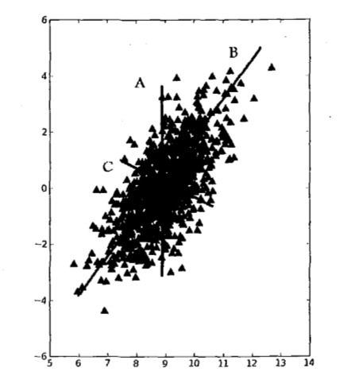
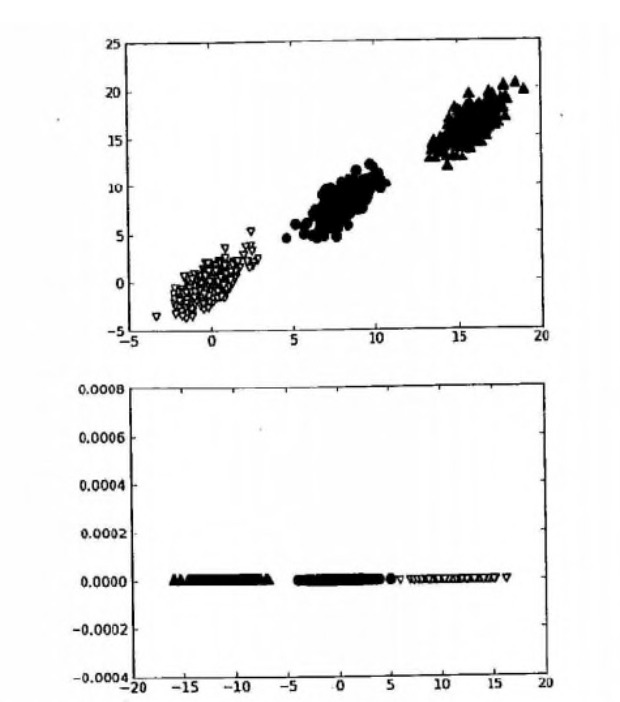
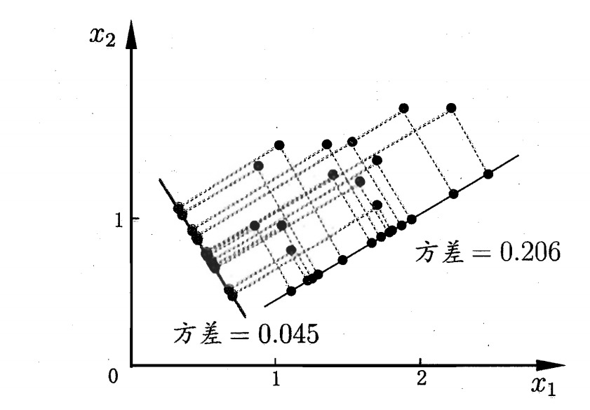
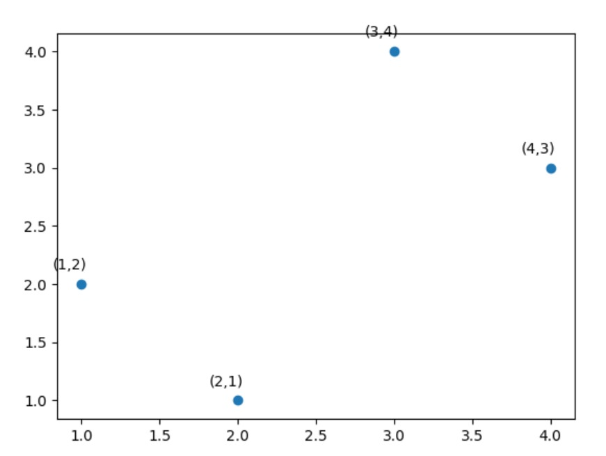

# 主成分分析

## 引入
在对实际问题进行数据挖掘时，涉及到的特证数即数据维度往往是成百上千的，出于以下两个原因可能导致数据集质量不佳：
* 噪声特征：该特征并不能对我们建模产生正向作用，或者同关注的变量基本上是不相关的
* 特征之间可替代性：当两个特征包含几乎一模一样的信息时，其中一个特征往往是可以剔除的（比如温度和体感温度变量）

主成分分析`Principal Component Analysis, PCA`是最常用的降维方法之一，它可以尽可能提取众多维度中的有效信息，降低数据的复杂度。（当然这也会以损失一部分信息作为代码，机器学习本身就处处充满了`trade-off`的过程）

> 在主成分分析方法中，数据从原来的坐标系转换到新的坐标系，而组成新坐标系的坐标轴正是原有特征的线性组合。第一个新坐标轴选择的是原始数据中方差最大的方向（因为方差越大表示数据代表越多的信息），第二个新坐标轴选择的是和第一个坐标轴正交（组成坐标系的重要条件，且不会浪费信息）且具有最大方差的方向。该过程一直重复，重复次数即为原始数据中特征的数目。由于新坐标轴的方差逐渐递减，我们会发现大部分的方差都包含在最前面的几个坐标轴中，因此我们忽视余下的坐标轴（这就是以损失一部分信息为代价）即完成数据的降维。

## 二维视角下PCA的原理
以如下坐标空间中的大量数据点为例，如果我们需要作出一条尽可能覆盖所有点的直线，那么最合适的就是直线$$B$$。该直线覆盖了数据的最大方差，即在单维度的情况下给出了数据最重要的信息。在选择了覆盖数据最大差异性的坐标轴之后，我们选择和第一条坐标轴正交的直线$$C$$作为第二条坐标轴。

> 总而言之，我们将数据坐标轴旋转至数据角度上最重要的方向。

前面我们从数据方差的角度旋转坐标轴找出代表数据信息重要性依次递减的两条新坐标轴（如果原始数据有$$n$$个维度，我们就能找到重要性依次递减的$$n$$条坐标轴）。 

接下来我们讲一下如果根据信息量进行降维。下图包含了三个类别，但是我们可以仅根据横坐标一个维度的信息即可完成效率较高的分类（在这个例子中，纵坐标即是代表数据信息量较少的噪声数据），例如$$x<4$$的样本可以完全归为一类。

现在我们把视角放到$$n$$维数据中，我们先从数据方差最大的方向抽取出第一个主成分，第二个主成分则来自于数据差异性次大的方向，并且需要满足和第一个主成分正交的关系。一旦得到数据差异性递减的$$n$$个主成分，我们就可以保留其中最大的前$$m$$个主成分，从而将原始数据集投射到新的低维空间（即超平面，直线的高维推广）上，实现降维的目的。

## 数学推导
对于正交属性空间（高维坐标系）中的样本点，如果我们需要用一个超平面（直线的高维推广，相当于降维）对样本进行恰当的表达，可以从以下两个思路入手：
* 最近重构性：样本点到这个超平面的距离都足够近
* 最大可分性：样本点在这个超平面的投影尽可能分开

> 最近重构性表示降维后忽视的坐标轴带来的信息损失尽可能最少，最大可分性表示新的坐标系尽可能代表原来样本点更多的信息。这两者本质上是一致的。

基于最近重构性和最大可分性，我们可以得到主成分分析的两种等价推导：
#### 1. 最近重构性
假定数据样本进行了中心化，即$$\sum_{i}x_i=0$$，再假定原先的坐标$$\{x_1,x_2,...,x_d\}$$投影后得到的新坐标系为$$w_1,w_2,...,w_d$$，其中$$w_i$$是标准正交向量（基向量的思想）：
* $$||w_i||_2=1$$
* $$w_i^Tw_j=0$$  

如果我们丢弃新坐标系中的部分坐标，即将维度降低到$$d'<d$$，则第$$i$$个样本点$$\mathbf{x}_i$$在低纬坐标系中的投影为$$\mathbf{z}_i=(z_{i1};z_{i2};...;z_{id'})$$，其中$$z_{ij}=\mathbf{w}_j^T\mathbf{x}_i$$是$$\mathbf{x}_i$$在低纬坐标系下第$$j$$维的坐标。基于$$\mathbf{z}_i$$来重构$$\mathbf{x}_i$$，我们可以得到：
$$
\hat{\mathbf{x}}_i=\sum_{j=1}^{d'}z_{ij}\mathbf{w}_j
$$
考虑一下整个训练集，原样本点$$\mathbf{x}_i$$与基于投影重构的样本点$$\hat{\mathbf{x}}_i$$之间的距离为：
$$
\begin{aligned}
\sum_{i=1}^{m}\Big|\Big|\sum_{j=1}^{d'}z_{ij\mathbf{w_j}-\mathbf{x}_i}\Big|\Big|_2^2 &= \sum_{i=1}^{m}\mathbf{z}_i^T\mathbf{z}_i-2\sum_{i=1}^{m}\mathbf{z}_i^T\mathbf{W}^T\mathbf{x}_i + const \\
& \propto -tr\Big(\mathbf{W}^T\Big(\sum_{i=1}^{m}\mathbf{x}_i\mathbf{x}_i^T\Big)\mathbf{W}\Big)
\end{aligned}
$$
其中$$\mathbf{W}=(w_1,w_2,...,w_d)$$，根据最近重构性的原理，我们应该最小化上式，有：
$$
\min_{\mathbf{W}} \quad -tr(\mathbf{W}^T\mathbf{XX}^T\mathbf{W})
$$
$$
s.t. \quad \mathbf{W}^T\mathbf{W} = \mathbf{I}
$$

#### 2. 最大可分性
> 最大可分性要求所有样本点在新坐标系中投影尽可能分开，也就是投影后样本点的方差应尽可能最大化。

如下图所示，在二维空间降维到一维空间（即直线）同时使所有样本点尽可能分开，我们需要使原始数据集尽量投影在最长的直线上，也就是最大化投影点的方差。

投影后样本点的方差为$$\sum_{i}\mathbf{W}^T\mathbf{x}_i\mathbf{x}_i^T\mathbf{W}$$，于是优化目标如下：
$$
\max_{\mathbf{W}} \quad tr(\mathbf{W}^T\mathbf{XX}^T\mathbf{W})
$$
$$
s.t. \quad \mathbf{W}^T\mathbf{W} = \mathbf{I}
$$

至此我们可以发现基于最近重构性和最大可分性的优化目标是等价的，使用拉格朗日乘子法可以得到：
$$
\mathbf{XX}^T\mathbf{w}_i=\lambda_i\mathbf{w}_i
$$
只需要对协方差矩阵$$\mathbf{XX}^T$$进行特征值分解，将求得的特征值排序：$$\lambda_1\geq \lambda_2 \geq ... \geq \lambda_{d}$$，取前$$d'$$个特征值对应的特征向量构成$$\mathbf{W}^*=(\mathbf{w}_1,\mathbf{w}_2,...,\mathbf{w}_{d'})$$即是主成分分析的解。

> 降维后的维数$$d'$$通常是根据实际情况选定，一方面可以选取不同维数对开销较小的分类器进行交叉验证来选取合适的$$d'$$值，另一方面也可以从重构的角度设置一个重构阈值（衡量了新选择的维数表达了原始数据集的信息量），设置阈值为$$t$$，然后选择使下式成立的最小$$d'$$值：
$$
\frac{\sum_{i=1}^{d'}\lambda_i}{\sum_{i=1}^{d}\lambda_i} \geq t
$$

## 计算实例
我们在二维空间下构造一个假的数据集，让数据沿着$$45$$度角分布，并且在与该方向垂直的方向上方差最小。

首先将上述数据集表示为一个矩阵$$\mathbf{X}$$：
$$
\mathbf{X}=\begin{bmatrix}
1 & 2\\ 
2 & 1\\ 
3 & 4\\ 
4 & 3
\end{bmatrix}
$$
我们可以计算$$\mathbf{X}^T\mathbf{X}$$为：
$$
\mathbf{X}^T\mathbf{X}=
\begin{bmatrix}
1 & 2 & 3 &4\\ 
2 & 1 & 4 & 3
\end{bmatrix}
\begin{bmatrix}
1 & 2\\ 
2 & 1\\ 
3 & 4\\ 
4 & 3
\end{bmatrix} = 
\begin{bmatrix}
30 & 28\\ 
28 & 30
\end{bmatrix}
$$
解析出对应的特征值为：$$\lambda_1=58,\lambda_2=2$$，对应的单位特征矩阵向量为：
$$
\mathbf{E}=
\begin{bmatrix}
1/\sqrt{2} & -1/\sqrt{2}\\ 
1/\sqrt{2} & 1/\sqrt{2}
\end{bmatrix}
$$
> 正交向量构成的任意矩阵都代表欧式空间下的一个坐标旋转，上面的这个矩阵可以看成是对原数据集施加一个$$45$$度的逆时针旋转，将原数据集$$\mathbf{X}$$乘上$$\mathbf{E}$$，得到：

$$
\mathbf{XE} = 
\begin{bmatrix}
1 & 2\\ 
2 & 1\\ 
3 & 4\\ 
4 & 3
\end{bmatrix}
\begin{bmatrix}
1/\sqrt{2} & -1/\sqrt{2}\\ 
1/\sqrt{2} & 1/\sqrt{2}
\end{bmatrix} = 
\begin{bmatrix}
3/\sqrt{2} & 1/\sqrt{2}\\ 
3/\sqrt{2} & -1/\sqrt{2} \\
7/\sqrt{2} & 1/\sqrt{2} \\
7/\sqrt{2} & -1/\sqrt{2}
\end{bmatrix}
$$
这意味着第一个数据点$$[1,2]$$变换到$$[3/sqrt{2},1/sqrt{2}]$$，如下图所示：

