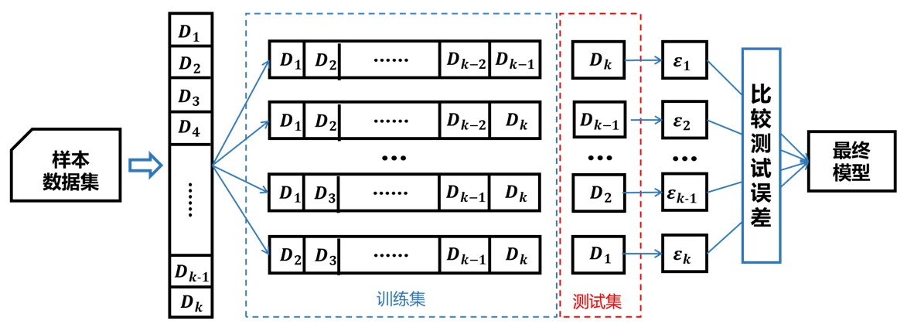

# 交叉验证

## 前言
当我们根据数据训练出一个机器学习模型时，我们希望它在新的数据上也保持较高的准备率，这就需要我们对学习到的不同模型有一个模型评估准则。

> 为了评估模型的泛化性能（指模型在未知数据上的预测能力），防止模型落入“**过拟合**”的陷进。我们人为地将原始数据划分为**训练集**和**测试集**，前者用于训练模型，后者用于评估模型的泛化性能。

## 训练集、验证集和测试集
在监督学习建模中，数据集常被划分为2~3组（验证集有时候不出现）：训练集（train set）、验证集（validation）和测试集（test set）。  
训练集用于训练模型，验证集用于确定控制模型复杂程度的参数，测试集用于评估模型的泛化性能。但实际应用中，我们常常简单将数据集划分为训练集和测试集。

## 交叉验证的类别
交叉验证包括简单交叉验证、K折交叉验证和留一法三种。

#### 1. 简单交叉验证
简单交叉验证直接将数据集划分为训练集和验证集，首先利用训练集在不同的参数组合下训练模型，然后在测试集上评价不同参数组合模型的误差，选择测试误差最小的模型。
#### 2.K折交叉验证
首先将样本数据集随机等分为$$K$$个互不相交的数据子集，然后依次将其中一份数据子集作为测试集，剩下$$K-1$$份数据子集作为训练集训练模型，最后以选取测试误差最小的模型作为最终模型。原理如下图所示：

#### 3.留一法
当$$K$$折交叉验证中的$$K$$等于数据集样本数$$N$$时，我们便得到了当$$K$$折交叉验证的特例：留一法。因为留一法使用的训练集只比原始数据集少了一个样本，因此评估结果往往比较准确。但当样本数据集较大时，需要训练模型也就越多。
> 因留一法的特殊性，往往在数据量较小的时候使用。
