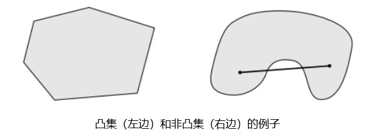
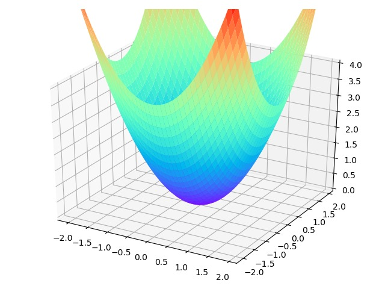
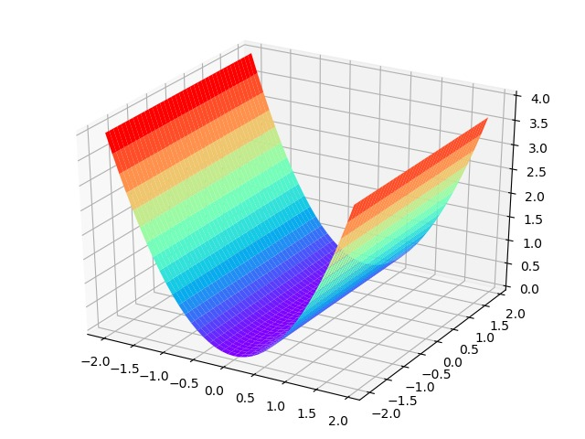

# 凸优化

## 定义
凸优化问题`OPT，convex optimization problem`，指定义在凸集中的凸函数最优化的问题。尽管凸优化的条件比较苛刻，但仍然在机器学习领域有十分广泛的应用。  

## 凸优化问题的优势
1. 凸优化问题的局部最优解就是全局最优解
2. 很多非凸问题都可以被等价转化为凸优化问题或者被近似为凸优化问题（例如拉格朗日对偶问题）
3. 凸优化问题的研究较为成熟，当一个具体被归为一个凸优化问题，基本可以确定该问题是可被求解的

## 相关数学概念
#### 1. 凸集
##### 1.1 定义：  
$$C$$是凸集，如果对于任意的$$x,y\in C$$和任意的$$\theta \in \mathbb{R}$$满足$$0\leq \theta \leq 1$$时，$$\theta x + (1-\theta)y  \in C$$ 恒成立   
##### 1.2 几何意义
直观来说，任取一个集合中的两点练成一条线段，如果这条线段完全落在该集合中，那么这个集合就是凸集。

#### 2. 凸函数
##### 2.1定义：  
定义在$$\mathbb{R}^n \rightarrow \mathbb{R}$$上的函数$$f$$是凸函数，如果它的定义域$$\mathbb{D}(f)$$是一个凸集且对任意的$$x,y\in \mathbb{D}$$和$$0\leq \theta \leq 1$$,$$f(\theta x +(1-\theta y)) \leq \theta f(x) + (1-\theta)f(y)$$恒成立  

##### 2.2几何意义：

##### 2.3凸函数的一阶充要条件：
假设定义在$$\mathbb{R}^n \rightarrow \mathbb{R}$$上的函数$$f$$可微（即对于所有$$x\in \mathbb{D}(f)$$，梯度$$\triangledown f(x)$$均存在）。则函数$$f$$是凸函数当且仅当函数定义域$$\mathbb{D}(f)$$是一个凸集，且对于所有$$x,y\in \mathbb{D}(f)$$均满足：
$$
f(y) \geq f(x)+\triangledown f(x)^T(y-x)
$$
> 一阶充要条件从几何意义上讲，即定义域内所有函数值都大于等于该点的一阶近似。

##### 2.4 凸函数的二阶充要条件： 
记函数的一阶导数和二阶导数分别为$$g$$和$$H$$：
$$
g=\triangledown 
f=\begin{bmatrix}
\frac{\partial f}{\partial x_1}\\ 
\frac{\partial f}{\partial x_2}\\ 
\vdots \\
\frac{\partial f}{\partial x_n}
\end{bmatrix} \quad
H=\triangledown^2f=
\begin{bmatrix}
\frac{\partial^2f}{\partial x_1^2} & \frac{\partial^2f}{\partial x_1 \partial x_2} & \cdots  & \frac{\partial^2f}{\partial x_1 \partial x_n}\\ 
\frac{\partial^2f}{\partial x_2 \partial x_1} & \frac{\partial^2f}{\partial x_2^2} & \cdots  & \frac{\partial^2f}{\partial x_2 \partial x_n}\\ 
\vdots & \vdots & \ddots & \vdots\\ 
\frac{\partial^2f}{\partial x_n \partial x_1} & \frac{\partial^2f}{\partial x_n \partial x_2} & \cdots  & \frac{\partial^2f}{\partial x_n^2}
\end{bmatrix}
$$
假设定义在$$\mathbb{R}^n \rightarrow \mathbb{R}$$上的函数$$f$$二阶可微（即对于所有$$x\in \mathbb{D}(f)$$，海森矩阵$$\triangledown^2 f(x)$$均存在）。则函数$$f$$是凸函数当且仅当函数定义域$$\mathbb{D}(f)$$是一个凸集，且对于所有$$x\in \mathbb{D}(f)$$均满足：
$$
\triangledown^2f(x) \succeq 0
$$
> 注意：这里的$$\succeq$$表示的是半正定。  

#### 3. 正定矩阵
##### 3.1 从二次型出发理解正定矩阵  
> 正定矩阵的概念是从正定二次型引入的，对称矩阵$$A$$为正定的充要条件即该矩阵的特征值全为正数。

为方便理解正定/半正定矩阵，我们引入二次型$$f(x)=x^TAx$$，对于含有$$n$$个变量的二次齐次函数，我们可以一般化地写为：
$$
f(x_1,x_2,...,x_n)=a_{11}x_1^2 + a_{22}x_2^2+...+a_{nn}x_n^2+2a_{12}x_1x_2+...+2a_{n-1,n}x_{n-1}x_{n}
$$
$$
f(x_1,x_2,...,x_n)=\sum_{i=1}^{n}a_{ii}x_i^2 + 2\sum_{i=1}^{n}\sum_{j=1}^{n} a_{ij}x_ix_j
$$

同时，对于所有的二次齐次式我们都可以写成矩阵形式：
$$
f(x_1,x_2,...,x_n) = x^TAx
$$
如果对任意的$$x\neq 0$$均有$$f(x) > 0$$，则称$$f(x)$$为正定二次型，同时称$$A$$为正定矩阵。

> 因为对于任意的二次型，我们都能将其写为矩阵形式，且矩阵$$A$$的形式为：
> $$
> \begin{bmatrix}
> a_{11} & a_{12} & \cdots & a_{1n} \\ 
> a_{21} & a_{22} & \cdots & a_{2n} \\ 
> \vdots & \vdots & \ddots & \vdots \\
> a_{n1} & a_{n2} & \cdots & a_{nn} 
> \end{bmatrix}
> $$
> 因此**二次型矩阵**和**对称矩阵**是一一对应的关系。

##### 3.2 从几何意义理解正定二次型
对于最简单的一元二次函数$$f(x)=x^2$$，当$$x\neq 0$$时$$f(x) > 0$$恒成立。即一元正定二次型对应的图像是开口向上，顶点在原点的抛物线，同理二元正定二次型$$f(x,y) = x^2 + y^2$$对应的图像是开口向上，顶点在原点的抛物面。

扩展到$$n$$元正定二次型的图像也对应着一个抛物线，保证当自变量取值非零向量时，对应的函数值大于0恒成立。

##### 3.3 半正定矩阵的图像  
同样我们可以给出二元半正定二次型的图像，即某个自变量的特征值为0从而保证当自变量取值为非零向量时，对应的函数值大于等于0恒成立。

## 凸优化问题
#### 1. 定义：
$$
\begin{aligned}
\min &\quad f(x) \\
s.t. &\quad g_i(x) \leq 0, i=1,2,...,m \\
&\quad h_j(x) = 0, j = 1,2,...,n
\end{aligned}
$$
当$$f(x)$$和$$g_i(x)$$均为凸函数，而$$h_j(x)$$均为仿射函数时, 上述的优化问题即凸优化问题。 

#### 2. 常见的凸优化问题
##### 2.1 线性规划（LP, Linear Program）
$$
\begin{aligned}
\min &\quad c^Tx+d \\
s.t. &\quad G(x) \preceq h \\
&\quad A(x) = b
\end{aligned}
$$
其中目标函数和不等式约束都是仿射函数，且$$\preceq$$表示按元素小于等于。

##### 2.2 二次规划（QP, Quadratic Program）
$$
\begin{aligned}
\min &\quad \frac{1}{2}x^TPx+c^Tx+d \\
s.t. &\quad G(x) \preceq h \\
&\quad A(x) = b
\end{aligned}
$$
其中目标函数为凸二次型，不等式约束为仿射函数。

##### 2.3 二次约束的二次规划（QCCP, Quadratically Contrained Quaratic Program）

$$
\begin{aligned}
\min &\quad \frac{1}{2}x^TPx+c^Tx+d \\
s.t. &\quad \frac{1}{2}x^TQ_ix + r_ix + s_i \leq 0, i=1,2,....m \\
&\quad A(x) = b
\end{aligned}
$$
其中目标函数和不等式约束都是凸二次型。

##### 2.4 半正定规划（SDP, Semidefinite Program）
$$
\begin{aligned}
\min &\quad tr(CX) \\
s.t. &\quad tr(A_iX)=b_i, i=1,2,....p \\
&\quad X \succeq 0
\end{aligned}
$$
其中需要最优化的变量$$X$$是一个对称的半正定矩阵，且$$C, A_1,...,A_p$$为对阵矩阵。

#### 3. 凸优化问题的一般求解过程

由于凸优化问题具有局部最优解即全局最优解的优良特性，因此求解过程可以简化为：找到一个点列使得目标函数值持续减少，直到触发停止条件或达到一个最小值。  

设$$x_k$$为第$$k$$次迭代的值，$$d_k$$为第$$k$$次搜索方向，$$\alpha_{k}$$为第$$k$$次迭代的步长，则第$$k$$次迭代公式为：
$$
x_{k+1}=x_k+\alpha_k d_k
$$
其中第$$k$$次的搜索方向满足：
$$
\triangledown f(x_k)^Td_k < 0
$$
$$
f(x_{k+1}) = f(x_k+\alpha_k d_k) <f(x_k)
$$

## Reference
[1] https://www.jiqizhixin.com/articles/2019-03-05-8

[2] https://www.zhihu.com/question/38902714/answer/195435181

[3] https://www.jianshu.com/p/62539b0316e2

[4] http://cs229.stanford.edu/section/cs229-cvxopt.pdf