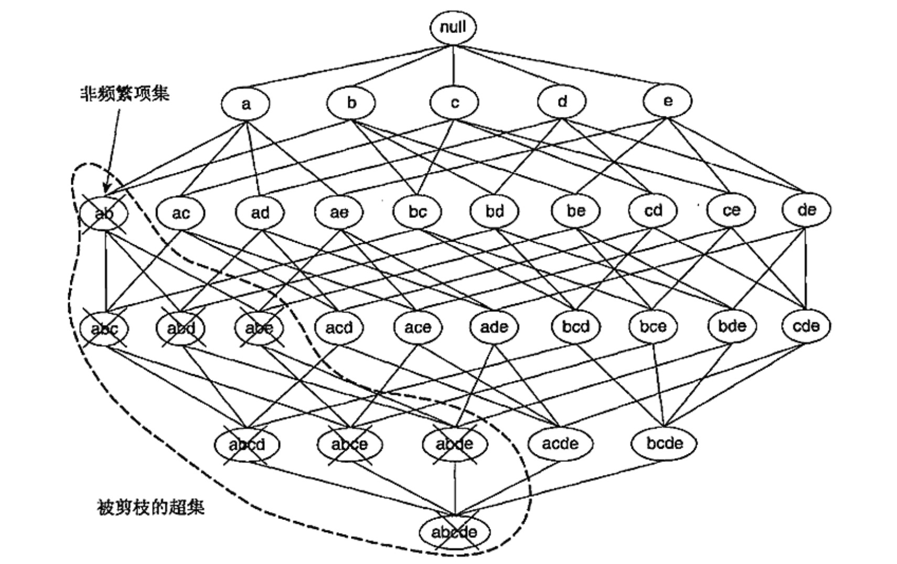

# 关联分析

## 相关概念
#### 1.关联分析
全球零售巨头沃尔玛分析消费者购物行为时偶然发现男性顾客同时购买啤酒和尿布的比例较高，于是通过将啤酒和尿布捆绑销售的方式提高了两者的销量。这种用于发现隐藏在大型数据集中的有意义联系的分析方法即是关联分析`association analysis`，所发现的规则可以用关联规则`association rule`或频繁项集的形式表示：
$$
\{\text{尿布}\} \rightarrow\{\text{啤酒}\}
$$

#### 2.购物篮数据
许多企业在日复一日的运营中积累了大量的数据，比如商店收银台每天收集的大量顾客购物数据。有一类数据，每一行对应着一个事务，这类数据通常被称为购物篮数据`market basket transactiontcd`

#### 3.二元表示
购物篮数据可以用二元形式表示，其中每个事务中有多个项。项可以用**二元变量**表示，如果项在事务中出现则它的值为1，否则为0。
> 因为通常认为项在事务中出现比不出现更重要，所以项是非对称`asymmetric`二元变量。

典型的购物篮数据及其二元表示如下：

| TID | 面包 | 牛奶 | 尿布 | 啤酒 | 鸡蛋 | 可乐 |
| --- | ---- | ---- | ---- | ---- | ---- | ---- |
| 1   | 1    | 1    | 0    | 0    | 0    | 0    |
| 2   | 1    | 0    | 1    | 1    | 1    | 0    |
| 3   | 0    | 1    | 1    | 1    | 0    | 1    |
| 4   | 1    | 1    | 1    | 1    | 0    | 0    |
| 5   | 1    | 1    | 1    | 0    | 0    | 1    |

#### 4.项集和支持度计数
令$$I=\{i_1,i_2,...,i_d\}$$是购物篮数据中所有项的集合，而$$T=\{t_1,t_2,...,t_N\}$$是所有事务的集合。在关联分析中，包含$$0$$个或多个项的集合被称为项集`itemset`。如果一个项集包含$$k$$个项则称为$$k$$项集。 
如果项集$$X$$是事务$$t_j$$的子集，则称事务$$t_j$$包含项集$$X$$。项集的一个重要性质就是它的支持度计数，即包含特定项集的事务个数。数学上，项集$$X$$的支持度计数$$\sigma(X)$$表示为：
$$
\sigma(X) = |{t_i|X\subseteq t_i, t_i\in T}|
$$

#### 5.关联规则：支持度与置信度
关联规则`association rule`指的是形如$$X \rightarrow Y$$的蕴涵表达式，其中$$X \cap Y = \varnothing $$。衡量关联规则强度可以用它的支持度`support`和置信度`confidence`来表示：
* 支持度：确定规则可以用于给定数据集的频繁程度
* 置信度：确定$$Y$$在$$X$$中出现的频繁程度

$$
s(X \rightarrow Y) = \frac{\sigma(X \cup Y)}{N}
$$
$$
c(X \rightarrow Y) = \frac{\sigma(X \cup Y)}{\sigma(X)}
$$
> 支持度主要是用于删去无意义的规则（说明这些规则可能是偶然出现），置信度衡量推理出的规则的可靠性。对于给定的规则$$X \rightarrow Y$$，置信度越高，$$Y$$包含在$$X$$中的可能性也就越大。置信度可以估计$$Y$$在$$X$$给定情况下的条件概率。

#### 6.关联规则发现
给定事务的集合$$T$$，关联规则发现指的是找出支持度大于等于`minsup`并且置信度大于等于`minconf`的所有规则。

> 挖掘关联规则的原始做法是：计算每个可能规则的支持度和置信度。但是从数据集提取的规则的数目达指数级别（包含$$d$$个项的数据集提取的可能规则总数为$$R=3^d-2^{d+1}+1$$），因此这种做法的代码极高。

一种可靠的提高关联规则算法性能的方法将关联规则挖掘任务拆分为如下的两个子任务：
* 频繁项集产生：发现满足最小支持度阈值的所有项集，这些项集被称为频繁项集`frequent itemset`
* 规则的产生：目标是从上一步中发现的频繁项集中提取所有高置信度的规则，这些规则被称为强规则`strong rule`

> 通常频繁相机产生所需的计算开销远大于产生规则所需的计算开销

## 频繁项集的产生
一般包含$$k$$个项的数据集可能产生$$2^k-1$$个频繁项集（不包括空集）。当$$k$$足够大时，需要搜索的项集空间是指数规模的。下图展示了$$I=\{a, b, c, d\}$$的项集格结构`lattice structure`。

最笨的方法是挨个确定格结构中每个候选项集`candidate itemset`的支持度计数，需要进行$$\mathcal{O}(NMw)$$次比较，其中$$N$$表示事务数，$$M=2^k -1$$表示候选项集数，$$w$$是事务的最大宽度。  

有如下方法可以降低产生频繁项集的计算复杂度：
* 减少候选项集的数目$$M$$，比如下文介绍的先验`apriori`原理，可以不用计算支持度值而删除某些候选项集
* 减少比较次数：替代将每个候选项集和每个事务相匹配的方法，可以使用更高级的数据结构或者存储候选项集或者压缩数据集来减少比较次数

#### 1.先验原理
> 先验原理：如果一个项集是频繁的，则它的所有子集都是频繁的；如果一个项集是非频繁的，则它的所有超集也一定是非频繁的。

#### 2.`Apriori`算法的频繁项集产生
令$$C_k$$为候选$$k$$项集的集合，而$$F_k$$为频繁$$k$$项集集合，先验算法可表示为：
* 确定每个项的支持度，得到频繁$$1$$项集的集合$$F_1$$
* 使用上一次迭代发现的频繁$$k-1$$项集产生新的候选$$k$$项集
* 确定候选项的支持度计数，删去支持度计数小于`minsup`的所有候选项集
* 当没有新的频繁项集产生，即$$F_k = \varnothing$$时算法结束

#### 3.计算复杂度
`Apriori`算法的计算复杂度受如下因素影响：
* 支持度阈值：降低支持度阈值通常将导致更多的频繁项集，算法需要扫描数据集的次数也将增多
* 项数（维度）：随着项数的增加，需要更多的空间存储箱的支持度计数
* 事务数：由于该算法需要反复扫描数据集，因此它的运行时间随着事务数增加而增加
* 事务的平均宽度：一方面频繁项集的最大长度随着事务平均宽度增加而增加，另一方面也会增加支持度计数时`Hash`树的遍历次数

## 规则产生
忽略前件或者后件为空的规则（$$\varnothing \rightarrow Y$$或$$Y \rightarrow \varnothing$$），每个频繁项集可以产生多达$$2^k-2$$个关联规则。关联规则可以这样提取：将项集$$Y$$划分为两个非空的子集$$X$$和$$Y-X$$，使得$$X \rightarrow Y-X$$满足置信度阈值即可。

> 如果规则$$X \rightarrow Y-X$$不满足置信度阈值，则形如$$X' \rightarrow Y-X'$$的规则也一定不满足置信度阈值，其中$$X'$$是$$X$$的子集。

#### 1.基于置信度的剪枝
> 定理：如果$$X \rightarrow Y-X$$不满足置信度阈值，则形如$$X' \rightarrow Y-X'$$的规则也一定不满足置信度阈值，其中$$X'$$是$$X$$的子集。

#### 2.`Apriori`算法中规则的产生
`Apriori`算法采用一种逐层方法来产生关联规则，其中每层对应于规则后件中的项数。首先提取规则后件只含一个项的所有高置信度规则，使用这些规则来产生新的候选规则，如下图所示：
