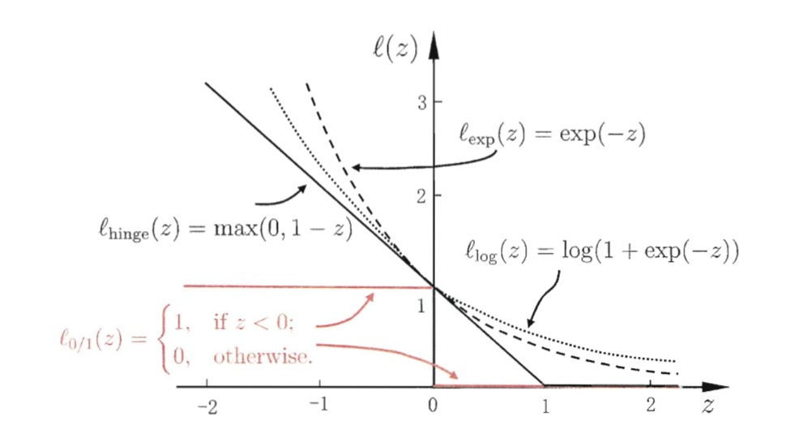

# 支持向量机

#### 原理
分类学习最基本的思想就是基于训练集$$D$$在样本空间中找到一个划分超平面，将不同类别的样本区分开。但是事实上，能将训练样本划分开的超平面可能有很多，如下图所示，我们的任务就是寻找到最优的划分超平面。

划分超平面的线性方程可以表达为：

$$
w^Tx+b=0
$$
其中$$w$$为法向量，决定了超平面的方向；$$b$$为位移项，决定了超平面与原点之间的距离。划分超平面可由法向量$$w$$和位移项$$b$$确定，我们将其记为$$(w,b)$$。**样本空间中任意点$$x$$到超平面的$$(w,b)$$的距离**可写为：

$$
r=\frac{|w^Tx+b|}{||w||}
$$
假设划分超平面能将样本正确分类，那么即位于超平面两侧的分别为正例和负例，即：

$$
\begin{cases}
\text{若}y_i=+1,\text{则有}w^Tx+b>0\\
\text{若}y_i=-1,\text{则有}w^Tx+b<0
\end{cases}
$$
我们构建如下模型：
$$
\begin{cases}
w^Tx+b\geq+1,y_i=+1\\
w^Tx+b\leq-1,y_i=-1
\end{cases}
$$
其中距离超平面最近的几个训练点正好使上式等号成立，它们被称为“支持向量”`support vector`，任意两个异类支持向量到超平面的距离之和为：

$$
y=\frac{2}{||w||}
$$
它也被称为“间隔”`margin`。支持向量与间隔的含义如下图所示：

## 支持向量机模型
为了找到合适的划分超平面使得产生的分类结果是最鲁棒的(即对未见示例的泛化能力最强)，我们令划分超平面的“间隔”最大化：
$$
\max_{w,b}\quad\frac{2}{||w||}
$$
$$
s.t. \quad y_i(w^Tx+b)\geq1,i=1,2,...,m
$$
等价于：
$$
\min_{w,b}\quad\frac{1}{2}||w||^2
$$
$$
s.t. \quad y_i(w^Tx+b)\geq1,i=1,2,...,m
$$
## 参数求解
对上式使用拉格朗日乘子法可以得到:

$$
L(w,b,a)=\frac{1}{2}||w||^2+\sum_{i=1}^{m}a_i(1-y_i(w^Tx_i+b))
$$
对$$w$$和$$b$$求偏导为零后：

$$
w=\sum_{i=1}^{m}a_iy_ix_i,
0=\sum_{i=1}^{m}a_iy_i
$$
将求完偏导后的值代入原方程后可以消去$$w$$和$$b$$,得到对偶问题：
$$
\max_{a} \quad\sum_{i=1}^{m}a_i-\frac{1}{2}\sum_{i=1}^{m}\sum_{j=1}^{m}a_ia_jy_iy_jx_i^Tx_j
$$
$$
s.t. \sum_{i=1}^{m}a_iy_i=0,a_i\geq0
$$
通过对偶问题解出$$a$$后，求出$$w$$和$$b$$的值即可得到模型：

$$
f(x)=w^Tx+b=\sum_{i=1}^{m}a_iy_ix_i^Tx_+b
$$
上述过程需要满足`KKT(Karush-Kuhn-Tucker)`条件，即要求：
$$
\begin{cases}
a_i\geq0\\
y_if(x_i)-1\geq0\\
a_i(y_if(x_i)-1)=0
\end{cases}
$$
从而对于任意的训练样本$$(x_i,y_i)$$总有$$a_i=0$$或者$$y_if(x_i)=1$$。若$$a_i=0$$，则模型中不会出现该样本，也就不会对$$f(x)$$有影响；若$$a_i>0$$，则必然有$$y_if(x_i)=1$$,所对应的样本点正好在最大间隔边界上，是一个支持向量。 

这说明：**训练完成后，大部分的训练样本不需要保留，最终模型只与支持向量有关**。

## SMO算法
上面我们得到支持向量机的对偶问题：
$$
\max_{a} \quad\sum_{i=1}^{m}a_i-\frac{1}{2}\sum_{i=1}^{m}\sum_{j=1}^{m}a_ia_jy_iy_jx_i^Tx_j
$$
$$
s.t. \sum_{i=1}^{m}a_iy_i=0,a_i\geq0
$$
这本身是一个二次规划问题，可以利用通用的二次规划算法来求解。但是因为该问题的规模正比于训练样本数，这会在实际任务中造成很大的开销。为此人们通过利用问题本身的特性，提出了`SMO(Sequential Minimal Optimization)`算法:

> SMO算法：基本思路是固定$$a_i$$之外的所有参数，然后求$$a_i$$上的极值。由于存在约束，因此如果固定$$a_i$$之外的其他参数，那么$$a_i$$可直接由其他参数导出。因此`SMO`每次选择两个变量$$a_i$$和$$a_j$$并固定其他参数，在参数初始化后不断执行如下两个步骤直至收敛：  
>
> 1. 选取一对需更新的$$a_i$$和$$a_j$$  
> 2. 固定$$a_i$$和$$a_j$$以外的其他参数，求解规划问题获得更新后的$$a_i$$和$$a_j$$
## 核函数
在前面的推导过程中，我们假设训练样本是线性可分的，即存在一个划分超平面能将训练样本正确分类，但在现实任务中，原始样本空间可能并不存在一个能正确划分两类样本的超平面。如下图左侧的图就是非线性可分的。  
假若我们能将样本从原始空间映射到一个更高纬度的特征空间，使得样本在该特征空间内线性可分，那么支持向量机就可以继续使用。比如下图右侧的图就是将原始的二维空间映射到一个合适的三维空间，从而找到了合适的划分超平面。

映射到高维度的支持向量机模型可以表示为：

$$
f(x)=w^T\phi(x)+b,\text{其中}\phi(x)\text{表示将}x\text{映射后的特征向量}
$$

$$
\min_{w,b}\quad\frac{1}{2}||w||^2
$$

$$
s.t.\quad y_i(w^T\phi(x)+b)\geq1
$$
其对偶问题是：
$$
\max_{a}\quad \sum_{i=1}^{m}a_i-\frac{1}{2}\sum_{i=1}^{m}\sum_{j=1}^{m}a_ia_jy_iy_j\phi(x_i)^T\phi(x_j)
$$
$$
s.t. \quad\sum_{i=1}^{m}a_iy_i=0,a_i\geq0
$$
其中$$\phi(x_i)^T\phi(x_j)$$是样本$$x_i$$和$$x_j$$映射到高维空间后的内积。直接计算高维空间的内积是比较困难的，为了避开这个障碍，我们可以设想这么一个函数在原始样本空间即可计算在高维特征空间的内积。

$$
k(x_i,x_j)=<\phi(x_i),\phi(x_j)>=\phi(x_i)^T\phi(x_j)
$$
最终的模型可以写成：

$$
f(x)=w^T\phi(x)+b=\sum_{i=1}^{m}a_iy_i\phi(x_i)^T\phi(x)+b=\sum_{i=1}^{m}a_iy_ik(x,x_i)+b
$$
上述我们提到的$$k( \cdot, \cdot)$$就是核函数`kernel function`。 
我们希望样本在特征空间中是线性可分的，因此合适的特征空间对支持向量机的性能至关重要，然后在不知道特征映射的形式时，我们并不知道什么样的核函数是最合适的，而核函数也仅是隐式地定义了这个特征空间。因此核函数的选择是支持向量机模型的最大影响因素。 
常用的核函数包括了线性核、多项式核、高斯核、拉普拉斯核和`Sigmoid`核等。如下表所示：

另外，不同核函数经过组合后也可形成新的核函数，比如：
1. 若$$k_1$$和$$k_2$$为核函数，则对于任意正数$$y_1$$和$$y_2$$，其线性组合$$y_1k_1+y_2k_2$$也是核函数
2. 若$$k_1$$和$$k_2$$为核函数，则核函数的直积也是核函数
3.  若$$k_1$$为核函数，则对于任意函数$$g(x)$$,$$k(x,z)=g(x)k_1(x,z)g(z)$$也是核函数
## 软间隔与正则化
前面我们讨论的支持向量机模型都是假设存在一个超平面能将不同类别的训练样本完全分割开的，然而现实中很难确定合适的核函数是的训练样本在特征空间中完全线性可分。即使恰好找到了某个核函数使得训练集在特征空间中线性可分，也很难断定这个结果不是由过拟合所造成的。 
解决该问题的方法即允许支持向量机在一些样本上出错。为此，要引入“软间隔”`soft margin`的概念，如下图所示：

软间隔允许某些样本不满足约束：

$$
y_i(w^Tx_i+b)\geq1
$$
在最大化间隔的时候，不满足约束的样本应该尽可能的少，于是**优化目标**可以改写为：

$$
\min_{w,b}\quad\frac{1}{2}||w||^2+C\sum_{i=1}^{m}l_{0/1}(y_i(w^Tx_i+b)-1)
$$
其中$$C$$一个大于0的常数，$$l_{0/1}$$是“0/1”损失函数，但是该损失函数数学性质不佳(非凸，非连续)，下面我们给出常用的三种替代损失函数：

$$
l_{hinge}(z)=max(0,1-z)
$$
$$
l_{exp}=exp(-z)
$$
$$
l_{log}(z)=log(1+exp(-z))
$$

