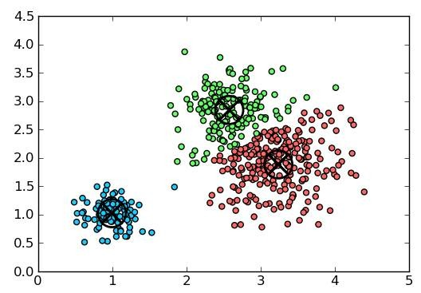
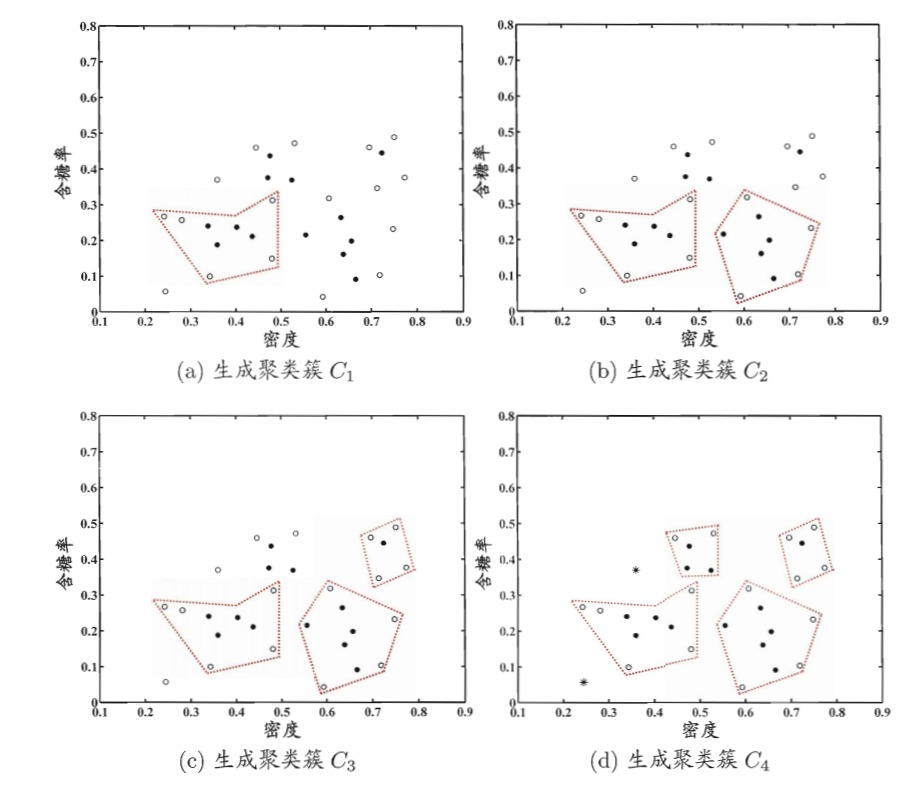
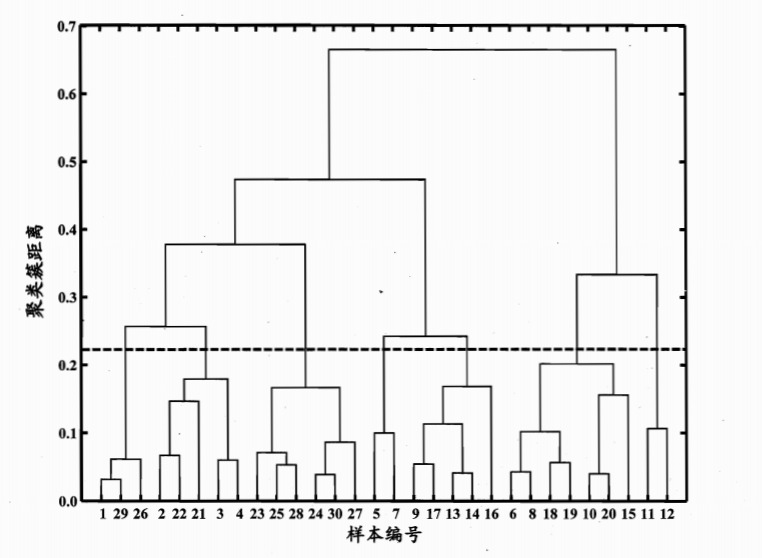

# 聚类学习

## 简介
在无监督学习中`unsupervised learning`中，训练样本的标记信息是未知的，其目标是通过对无标记训练样本的学习来揭示数据的内在性质及规律，为进一步的数据分析提供基础。而此类学习任务中应用最广、研究最多的即聚类`clustering`。 

以通俗的语言讲解，聚类学习将数据集中的样本分成若干个互不相交的子集（称为簇`cluster`）。保持簇内差异尽可能小而簇间差异尽可能大我们就可以将每个簇映射到一些潜在的类别。

> 需要注意的是，划分的类别对于聚类而言事先是位置的，聚类过程仅能将数据集自动划分为不同的簇，但每个簇对应的概念语义是需要使用者自己来把握和命名。

## 数学描述
照旧我们以数学语言描述聚类学习，假定样本集$$D = \{x_1, x_2, ..., x_m\}$$包含$$m$$个无标记样本，每个样本$$x_i = (x_{i1};x_{i2};...;x_{im})$$是一个$$n$$维特征向量，则聚类算法将样本$$D$$划分为$$k$$个不相交的簇$$\{C_l | l=1,2,...,k\}$$。我们用$$\lambda_j\in{1,2,...,k}$$表示样本$$x_j$$的簇标记`cluster label`，则聚类结果可用包含$$m$$个元素的簇标记向量$$\lambda=(\lambda_1;\lambda_2;...;\lambda_m)$$表示。

## 性能度量
> 从本质上讲，我们希望聚类形成簇内方差尽可能小而簇间方差尽可能大的分类结果，即相同类别的元素尽可能相似而归属不同类别的元素尽可能不同。

对数据集$$D=\{x_1,x_2,...,x_m\}$$，假定通过聚类给出的簇划分为$$C=\{C_1,C_2,...,C_k\}$$，定义：

$$
avg(C)=\frac{2}{|C|(|C|-1))}\sum_{1\leq i<j \leq |C|}dist(x_i, x_j)
$$
$$
diam(C)=max_{1 \leq i < j \leq |C|}dist(x_i, x_j)
$$
$$
d_{min}(C_i,C_j)=min_{x_i\in C_i, x_j\in C_j}dist(x_i, x_j)
$$
$$
d_{cen}(C_i,C_j) = dist(\mu_i, \mu_j)
$$
$$
\mu = \frac{1}{|C|}\sum_{1\leq i \leq |C|}x_i
$$
其中$$dist(x_i, x_j)$$衡量两个样本之间的距离，$$\mu$$表示簇$$C$$的中心点，$$avg(C)$$表示簇$$C$$内样本间的平均距离，$$diam(C)$$表示簇$$C$$内样本间的最远距离，$$d_{min}(C_i,C_j)$$表示两个簇最近样本间的距离，$$d_{cen}(C_i,C_j)$$表示两个簇中心点间的距离。 
基于这些指标，我们常用下面的聚类性能度量聚类效果：

* DB指数`Davies-Bouldin Index`：值越小表示聚类效果越好
$$
DBI = \frac{1}{k}\sum_{i=1}^{k} \max_{j \neq i}(\frac{avg(C_i)+avg(C_j)}{d_{cen}(\mu_i,\mu_j)})
$$
* Dunn指数`Dunn Index`：值越大表示聚类效果越好
$$
DI = \min_{1 \leq i \leq k}\{\min_{j\neq i}(\frac{d_{min}(C_i,C_j)}{max_{1 \leq l \leq k} diam(C_l)}) \}
$$
给定样本$$x_i=(x_{i1};x_{i2};...;x_{in})$$和$$x_j=(x_{j1};x_{j2};...;x_{jn})$$,度量两个样本点间距离$$dist(x_i, x_j)$$的方法有很多种，最常用的就是“闵可夫斯基距离”`Minkowski distance`：
$$
dist_{mk}(x_i,x_j) = (\sum_{u=1}{n}|x_{iu}-x_{ju}|^p)^{\frac{1}{p}}
$$
> 当$$p=2$$时，闵可夫斯基距离等价于欧式距离`Euclidean distance`；$$p=1$$时，闵可夫斯基距离等价于曼哈顿距离`Manhattan distance`

## k均值算法
给定样本集$$D=\{x_1,x_2,...,x_m\}$$，`k-means`最小化聚类所得簇划分$$C=\{C_1,C_2,...,C_k\}$$的平方误差：
$$
E=\sum_{i=1}^{k}\sum_{x\in C_i}||x-\mu_i||_2^2
$$
最小化上式需要遍历样本集$$D$$中所有可能的簇划分，这本身就是一个`NP`难的问题，因此`k-means`算法采取了贪心策略，通过迭代优化来近似求解。 
**输入**：样本集$$D=\{x_1,x_2,...,x_m\}$$，聚类簇数$$k$$ 
**输出**：最优的簇划分$$C=\{C_1,C_2,...,C_k\}$$  

1. 从$$D$$中随机抽取$$k$$个样本作为初始均值向量$$\{\mu_1,\mu_2,...,\mu_k \}$$
2. 遍历$$D$$中的每个样本$$x_j$$，计算它与各均值向量$$\mu_i(1\leq i \leq k)$$的距离：$$d_{ji}=||x_j-\mu_i||_2$$，将样本划入离它最近的簇中：$$\lambda_j = argmin_{i\in{1,2,...,k}}d_{ji}$$，对应的簇更新为$$C_{\lambda_j}=C_{\lambda_j}\cup \{x_j\}$$
3. 对$$k$$个簇重新计算均值向量：$${\mu_i}'=\frac{1}{|C_i|}\sum_{x\in C_i}x$$，更新均值向量
4. 重复1-3步骤直至均值向量不再更新

## 高斯混合聚类
#### 1.多元高斯分布
先回顾以下多元高斯分布的概率密度函数：
$$
p(x) = \frac{1}{(2\pi)^{\frac{n}{2}}|\sum|^{\frac{1}{2}}}e^{-\frac{1}{2}(x-\mu)^T\sum^{-1}(x-\mu)}
$$
其中$$\mu$$是均值向量，$$\sum$$是$$n\times n$$的协方差矩阵，高斯分布完全由均值向量$$\mu$$和协方差矩阵$$\sum$$这俩参数确定，因此我们可将其记为$$p(x|\mu \sum)$$。

#### 2.高斯混合分布
基于多元高斯分布的概念，我们可定义高斯混合分布：
$$
p_{\mathcal{M}}(x)=\sum_{i}^k \alpha_i * x|\mu_i, \sum_i)
$$
该分布共由$$k$$个混合分布组成，每个混合成分对应一个高斯分布，而$$\alpha_i>0$$为相应的混合系数`mixture coefficient`，且满足$$\sum_{i=1}^{k}\alpha_i = 1$$

#### 3.高斯混合聚类原理
假设样本的生成过程由高斯混合分布给出：首先根据$$\alpha _i$$定义先验分布选择高斯混合成分，然后根据被选择的混合成份的概率密度函数进行采样，从而生成相应的样本。 

给定训练集$$D=\{x_1,x_2,...,x_m\}$$由上述过程生成，令随机变量$$z_j\in \{1,2,...,k\}$$表示生成样本$$x_j$$的高斯混合成分，其取值未知。根据贝叶斯定理，可以计算$$z_j$$的后验分布为：
$$
\begin{aligned}
p_{\mathcal{M}}(z_j=i|x_j) &= \frac{P(z_j=i)\times p_{\mathcal(M)}(x_j|z_j=i)}{p_{\mathcal{M}}(x_j)} \\
&= \frac{\alpha_i \times p(x_j|\mu_i, \sum_i)}{\sum_{l=1}^{k}\alpha_l\times p(x_j|\mu_l,\sum_l)}
\end{aligned}
$$
即$$p_{\mathcal{M}}(z_j=i|x_j)$$给定了样本$$x_j$$由第$$i$$个高斯混合成分生成的后验概率，我们将其记为$$\gamma_{ji}$$，高斯混合聚类将样本集$$D$$划分为$$k$$个簇$$C=\{C_1,C_2,...,C_k\}$$，每个样本$$x_j$$的簇标记$$\lambda_j$$确定如下：
$$
\lambda_j=arg\min_{i\in\{1,2,...,k\}}\gamma_{ji}
$$

#### 4.高斯混合聚类算法
**输入**：样本集$$D=\{x_1,x_2,...,x_m\}$$；高斯混合成分个数$$k$$ 
**输出**：簇划分$$C=\{C_1,C_2,...,C_k\}$$  

1. 初始化高斯混合分布参数$$\{(\alpha_i,\mu_i,\sum_i)|1\leq i \leq k\}$$
2. 计算$$x_j$$由高斯各混合部分生成的后验概率，即$$\gamma_{ji}=p_{\mathcal{M}}(z_j=i|x_j)$$
3. 计算新均值向量$${\mu_i}'=\frac{\sum_{j=1}^{m}\gamma_{ji}x_j}{\sum_{j=1}^{m}\gamma_ji}$$，计算新协方差矩阵$${\sum_i}'=\frac{\sum_{j=1}^{m}\gamma_{ji}(x_j-{\mu_i}')(x_j-{\mu_i}')^T}{\sum_{j=1}^{m}\gamma_{ji}}$$，计算新混合系数$${\alpha_i}' = \frac{\sum_{j=1}^{m}\gamma_{ji}}{m}$$，并更新对应的三个模型参数
4. 重复进行2-3步骤直至满足停止条件（EM算法达到最大迭代次数或者似然函数增长很少）
5. 根据$$\lambda_j=arg\min_{i\in\{1,2,...,k\}}\gamma_{ji}$$将样本$$x_j$$划到对应的簇中，即$$C_{\lambda_j}=C{\lambda_j}\cup\{x_j\}$$

## 密度聚类DBSCAN
密度聚类`density-based clustering`假设聚类结构能通过样本分布的紧密程度确定，密度聚类算法从样本密度的角度来考察样本之间的可连接性，并基于可连接样本不断扩展聚类簇以获得最终的聚类结果。

#### 1.密度聚类的相关概念
给定数据集$$D=\{x_1,x_2,...,x_m\}$$，有如下概念：
* $$\epsilon$$邻域：$$N_{\epsilon}=\{x_i\in D|dist(x_i,x_j)\leq \epsilon\}$$，即样本集中与$$x_j$$距离不超过$$\epsilon$$的样本集合
* 核心对象`core object`：若$$x_j$$的$$\epsilon$$邻域内至少包含$$MinPts$$个样本，则它是一个核心对象
* 密度直达`directly density-reachable`：若$$x_j$$位于$$x_i$$的$$\epsilon$$邻域中，且$$x_i$$是核心对象，则称$$x_j$$由$$x_i$$密度直达
* 密度可达`density-reachable`：对$$x_i$$和$$x_j$$，若存在样本序列$$p_1,p_2,...,p_n$$，其中$$p_1=x_i, p_n=x_j$$且$$p_{i+1}$$由$$p_i$$密度直达，则称$$x_j$$由$$x_i$$密度可达
* 密度相连`density-connect`：对$$x_i$$与$$x_j$$，如果存在$$x_k$$使得$$x_i$$与$$x_j$$均由$$x_k$$密度可达，则称$$x_i$$和$$x_j$$密度相连

下图给出了密度聚类相关概念的直观展示：

> 在$$MinPts=3$$的情况下，虚线表示$$\epsilon$$邻域，$$x_1$$是核心对象，$$x_2$$由$$x_1$$密度直达，$$x_3$$由$$x_1$$密度可达，$$x_3$$与$$x_4$$密度相连。

#### 2.密度聚类原理
基于上述的概念，密度聚类将“簇”定义为：由密度可达关系导出的最大密度相连样本集合。从数学角度上讲，即给定邻域参数$$(\epsilon,MinPts)$$，簇$$C \subseteq D$$是满足以下性质的非空样本子集：
* 连接性`connectivity`：$$x_i \in C, x_j \in C \Rightarrow x_i\text{和} x_j \text{密度相连}$$
* 最大型`maximality`：$$x_i \in C, x_j\text{由}x_i\text{密度可达} \Rightarrow x_j \in C$$

不难证明，若$$x$$为核心对象，则由其密度可达的所有样本组成的集合满足连接性与最大性，该组合记为：

$$
X = \{ {x}' \in D| {x}'\text{由}x\text{密度可达}\}
$$

#### 3.密度聚类算法
**输入**：样本集$$D=\{x_1, x_2,...,x_m\}$$；邻域参数$$(\epsilon, MinPts)$$ 
**输出**：簇划分$$C=\{C_1,C_2,...,C_k\}$$  

1. 遍历所有样本，如果样本$$x_j$$的$$\epsilon$$邻域满足$$|N_{\epsilon}(x_j)| \geq MinPts$$，那么将其加入核心对象集合$$\Omega=\Omega \cup\{x_j\}$$
2. 随机抽取一个核心对象$$o\in \Omega$$，遍历该核心对象$$\epsilon$$邻域内的所有样本点$$q$$（包括它自身），如果该样本也是核心对象，则$$\Delta = N_{\epsilon}(q) \cap \Gamma$$
3. 对于2步骤中的核心对象，继续搜寻其$$\epsilon$$邻域内的所有样本点，更新$$\Delta$$，生成聚类簇$$C_1 = \Delta$$
4. 继续随机抽取一个核心对象生成聚类簇，重复2-3步骤，直至所有核心对象均被访问过为止。

直观展示如下：

## 层次聚类
层次聚类`hierarchical clustering`试图在不同层次上对数据集进行划分，从而形成树形的聚类结构，数据集的划分既可以采用“自底向上”的聚合策略，也可以采用“自顶向下”的分拆策略。

`AGNES`是一种自底向上聚合策略的层次聚类算法，它先将数据集中每个样本看成一个初始聚类簇，然后在算法运行的每一步中找到最近的两个聚类簇进行合并，该过程不断重复直至达到预设的聚类簇个数，关键在于如何计算连个聚类簇之间的距离。
#### 1. 计算距离的方式
最小距离：$$d_{min}(C_i,C_j))= \min_{x\in C_i,z \in C_j}dist(x,z)$$ 

最大距离：$$d_{max}(C_i,C_j))= \max_{x\in C_i,z \in C_j}dist(x,z)$$ 

平均距离：：$$d_{avg}(C_i,C_j))=\frac{1}{|C_i||C_j|}\sum_{x\in C_i}\sum_{z \in C_j}dist(x,z)$$ 

当聚类簇距离分别由$$d_{min}$$、$$d_{max}$$或$$d_{avg}$$计算时，`AGNES`算法被相应地成为“单链接”`single-linkage`、“全链接”`complete-linkage`或“均链接”`average-linkage`算法。

#### 2. 算法
**输入**：样本集$$D=\{x_1, x_2,...,x_m\}$$；聚类簇距离度量函数$$d$$；聚类簇数$$k$$ 

**输出**：簇划分$$C=\{C_1,C_2,...,C_k\}$$  

1. 每个样本最为单独一类，$$C_j=\{x_j\}$$
2. 计算任意两个样本簇间的距离：$$M(i, j) = d(C_i,C_j)$$
3. 找到距离最近的两个聚类簇$$C_{i*}$$和$$C_{j*}$$，将其合并$$C_{i*}=C_{i*}\cup C_{j*}$$，对于所有下标大于$$j$$的簇，将聚类簇$$C_j$$重编号为$$C_{j-1}$$
4. 根据最新的簇更新一下第2步骤计算的簇间距离矩阵
5. 重复2-4步骤直至当前聚类簇个数等于预设的聚类簇数$$k$$

#### 3. 树状图
令`AGNES`算法执行到所有样本出现在同一个簇中，可得到如下的树状图：

在树状图的特定层次上分割即可得到对应的簇划分结果，上图中虚线划分的位置将样本分为7个簇，理解一下背后的原理。