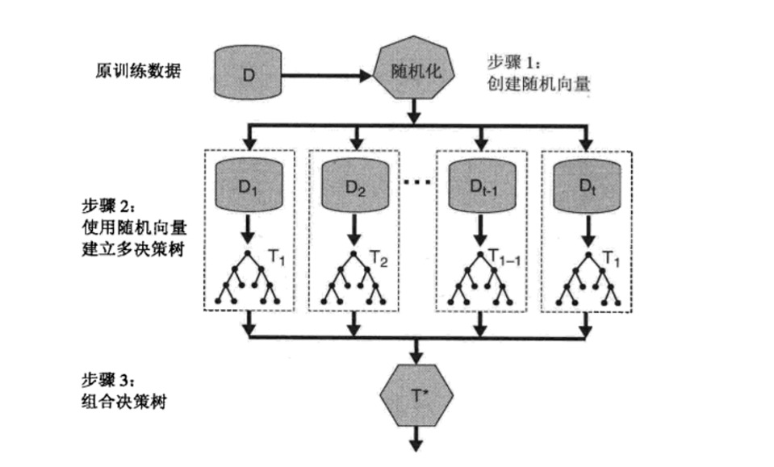
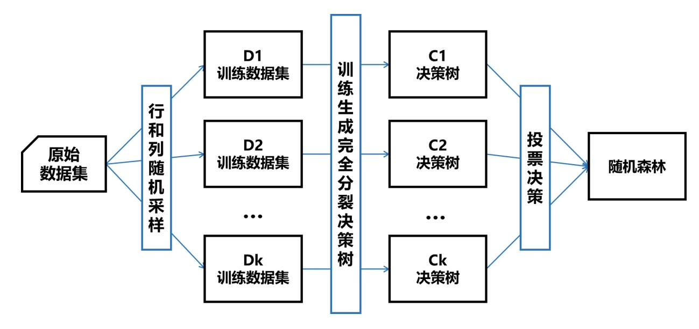

# 随机森林

## 单棵决策树的劣势
有时候单棵决策树可能难以实现较高的准确率，这主要是由以下几个方面决定的：

* 求解一棵最优（泛化误差最小）的决策树是一个`NP`难（无法穷极所有可能的树结构）问题，往往得到的是局部最优解。
* 单棵树构建的模型往往不够稳定，样本变动很容易引起树结构的变动
* 解决过拟合问题除划分测试集和训练集外依赖于剪枝

## 回顾：元算法
从统计学的角度来讲，将模型的性能寄希望于单棵决策树是不稳健的，这意味着它在处理未知数据时预测结果的方差是较大的。如同我们做重要决定时会考虑多个专家的意见，元算法`meta-algorithm`主张综合多个分类器的结果做预测，元算法也被称为集成方法`ensemble method`，主要思路包括：
* 不同算法的集成
* 同一算法在不同设置下的集成
* 数据集不同部分分配给不同分类器后的集成

#### 1. bagging
`boostrap aggregating`是对原始数据进行`$$S$$`次等概率的有放回抽样得到的和原数据集大小相等的`$$S$$`个新的数据集集合，再将某个学习算法作用于这`$$S$$`个数据集得到`$$S$$`个分类器，综合这`$$S$$`个分类器进行投票决策即可得到最终的分类结果。

#### 2. boosting
`boosting`和`bagging`一样都是使用相同的分类器作为基分类器，但是`boosting`中不同分类器是通过串行训练而获得的，每个新分类器都基于被已有分类器错分的样本而构造。
> `bagging`中不同分类器的权重是相等的，而`boosting`中不同分类器的权重取决于该分类器的性能。

## 随机森林简述
随机森林是一种以决策树为基分类器的集成算法，通过组合多棵独立的决策树后根据投票或取均值的方式得到最终预测结果的机器学习方法，往往比单棵树具有更高的准确率和更强的稳定性。随机森林相比于决策树拥有出色的性能主要取决于**随机抽取样本和特征**和**集成算法**，前者让它具有更稳定的抗过拟合能力，后者让它有更高的准确率。

#### 1. 基分类器的生成
随机森林本质上是一种集成算法，由众多的基分类器组成。其中组成随机森林的基分类器是CART树，各棵决策树独立生成且完全分裂，既可以解决分类问题又可以解决回归问题。
#### 2. 随机化
随机森林为了保证较强的抗过拟合和抗噪声能力，在构建每一棵CART决策树的时候采用了**行抽样和列抽样**的随机化方法。

* 行抽样

假设训练集的数据行数为N，对于每一棵CART树，我们从N个原始样本中有放回地随机抽取N个作为单棵树的训练集。假设随机森林中CART树数目为K，那么我们通过该办法生成K个独立的训练集用于CART的训练。对于单独一个样本而言，它在N次有放回地随机抽样中都不被抽中的概率是：
$$
(1-\frac{1}{N})^{\frac{1}{N}}
$$
当N足够大时，该式的结果约等于0.368，即在每一轮行抽样大概有36.8%的数据始终不会被采集到。

* 列抽样

假设原始数据集的特征数为M，在通过行采样获取每棵CART树的训练集后，随机森林会随机选取m个特征（m < M）训练用于每一棵CART树的生成。当m越小时，模型的抗干扰性和抗过拟合性越强，但是模型的准确率会下降，因此在实际建模过程中，常需要用交叉验证等方式选择合适的m值。

## 随机森林参数

#### 1. 随机选取的特征维数m

随机抽取的特征数m要满足小于等于总特征数M，其中m较小时模型的偏差增加但方差会减少，表现为拟合效果不佳但泛化效果增长。在建模过程中常通过OOB验证或者交叉验证确定m取值。

#### 2. 决策树个数k

决策树个数越多时模型的随机化效果越好，从而模型的测试误差越小。理论上在条件允许的范围内，决策树个数k的个数越多越好。当决策树个数较大的时候，测试误差的变化变得很小，这时候就可以确定较为合理的树的数量。

#### 3. 决策树深度d

当数据量较少或者特征数较少的时候可以不考虑这个值。但是当模型样本量和特征值都较多时，让决策树完全生长会导致随机森林模型的计算量较大从而速度越慢。

## 随机森林特征重要性
基于树的集成算法还有一个很好的特性，就是模型训练结束后可以输出模型所使用的特征的相对重要度，便于我们选择特征，理解哪些因素是对预测有关键影响。在随机森林中，简单来说，当某一特征在所有树中离树根的平均距离越近，这一特征在给定的分类或回归问题中就越重要。一般有两种计算特征重要性的方法：基于基尼系数和基于OOB袋外数据。

#### 1. 基于基尼系数  

随机森林中每棵树都是CART决策树，因此树在选择向下分裂的特征时，都是基于基尼系数。假设某特征的在某一棵树上的节点m向下分裂，分裂前的基尼系数为GI ，分裂后，左右分支的基尼系数分别为GIL、GIR则，VIm = GI - (GIL+GIR)。假设在这棵数上，该特征分裂了k次，则在这棵树上的重要性为：
$$
\sum_{i=1}^{k}VIm
$$

假设随机森林中，共有n棵数用到该特征，则整个森林中整个特征的重要性为：
$$
\sum_{j=1}^{n}\sum_{i=1}^{k}VIm
$$
最后把所有求得的M个特征重要性评分进行归一化处理就得到重要性的评分：
$$
\frac{\text{单特征重要性}}{\text{所有特征重要性之和}}
$$

#### 2. 基于袋外数据

1. 对于随机森林中的每一颗决策树,使用相应的OOB(袋外数据)数据来计算它的袋外数据误差,记为$$err_{OOB1}$$
2. 随机地对袋外数据OOB所有样本的特征X加入噪声干扰，再次计算它的袋外数据误差,记为$$err_{OOB2}$$
3. 假设随机森林中有N棵树,那么对于特征X的重要性为$$\sum(err_{OOB2}-err_{OOB1})/N$$。之所以可以用这个表达式来作为相应特征的重要性的度量值是因为：若给某个特征随机加入噪声之后，袋外的准确率大幅度降低，则说明这个特征对于样本的分类结果影响很大，也就是说它的重要程度比较高。而该方法中涉及到的对数据增加噪音或者进行打乱的方法通常有两种： 
  1.  使用`uniform`或者`gaussian`抽取随机值替换原特征
  2. 通过`permutation`的方式将原来的所有N个样本的第 i 个特征值重新打乱分布（相当于重新洗牌）

## 随机森林优点

* 行抽样和列抽样的引入让模型具有抗过拟合和抗噪声的特性
* 对数据的格式要求低：因为有列抽样从而能处理高维数据；能同时处理离散型和连续型；和决策树一样不需要对数据做标准化处理；可以将缺失值单独作为一类处理
* 不同树的生成是并行的，从而训练速度优于一般算法
* 给能出特征重要性排序
* 由于存袋外数据，从而能在不切分训练集和测试集的情况下获得真实误差的无偏估计

## 随机森林缺点

* 同决策树直观的呈现不同，随机森林是一个黑盒模型，无法追溯分类结果如何产生
* 由于算法本身的复杂性，随机森林建模速度较慢，在集成算法中也明显慢于`XGBoost`等其他算法
* 随着随机森林中决策树个数增多，训练时需要更多的时间和空间
