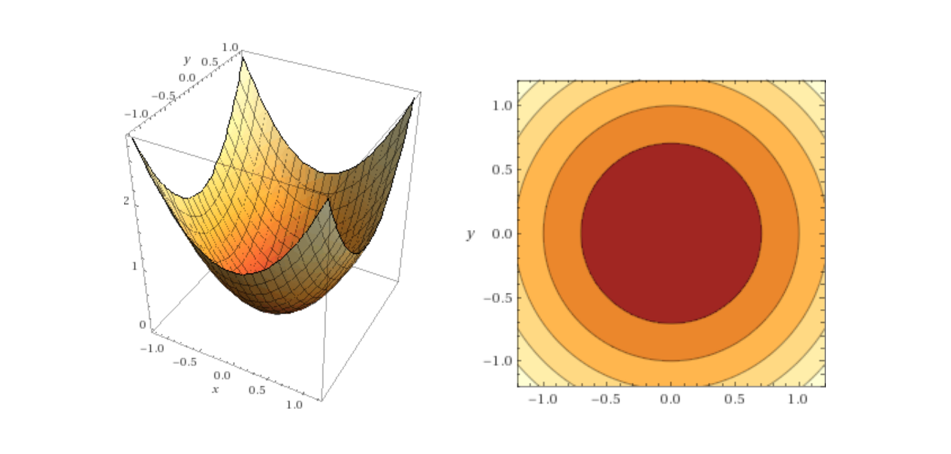
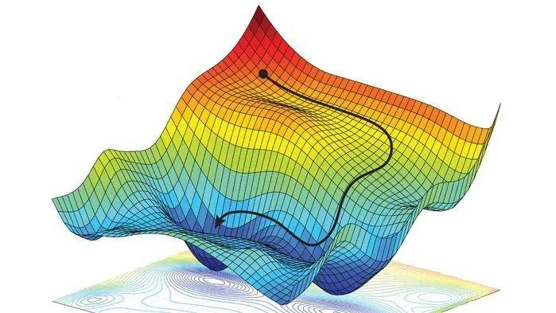
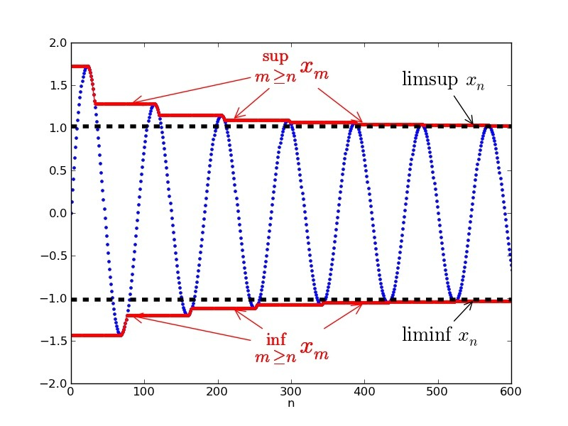
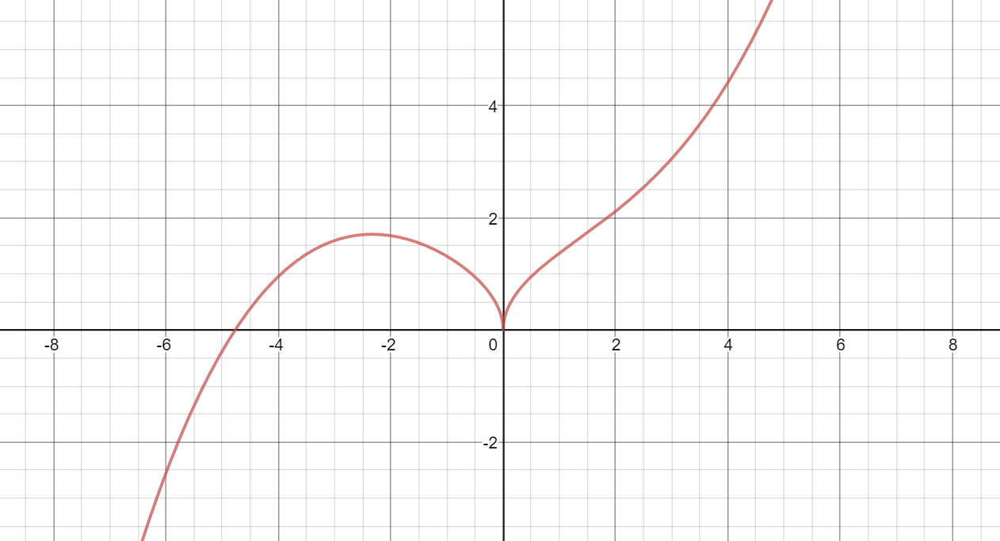
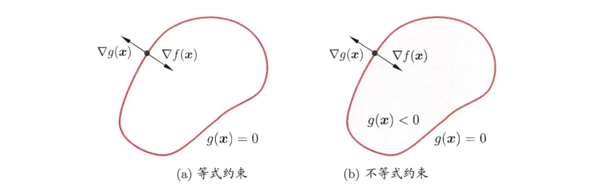

# 拉格朗日乘子法和对偶性

## 相关的数学概念
首先看一个二元函数（再复杂一点的函数就很难直观地呈现出来）的三维图像和对应的等高线，其中函数表达式为$$z=x^2+y^2$$：

#### 1. 从导数到偏导数
对于一个一元函数而言，导数的定义想必大家都很清楚，具体的表达式为：
$$
f'(x)=\lim_{\triangle x\rightarrow0}\frac{f(x+\triangle x)-f(x)}{\triangle x}=\lim_{\triangle x \rightarrow 0}\frac{f(x)-f(x-\triangle x)}{\triangle x}
$$

> 一元函数中只有一个自变量，因此在某个点的导数即函数在该点的斜率，高中物理在路程-时间问题中赋予导数的含义为瞬时速度。

对于一个二元函数$$f(x,y)$$，偏导数即固定其他变量时的函数变化率，也就是沿着坐标轴正方向的变化率：
$$
f_x(x,y) = \lim_{\triangle x \rightarrow 0} \frac{f(x+\triangle x,y)-f(x,y)}{\triangle x}
$$
$$
f_y(x,y) = \lim_{\triangle y \rightarrow 0} \frac{f(x, y+\triangle y)-f(x,y)}{\triangle y}
$$

#### 2. 方向导数
> 这里引入偏导数的原因是因为在多元函数中，经过函数某一点的切线有无数条，这些切线共同组成切平面。借助于“基向量”的思想，我们通过两个偏导数表示出经过该点的任意方向切线的导数，这也就是方向导数。

现在我们放开对所有变量的限制，记点$$(x,y)$$为二元函数上一点，自该点引一条射线$$l$$, 在该点射线方向邻域内存在一点$$(x+\triangle x,y+\triangle y)$$，那么函数沿着$$l$$方向的方向导数为：
$$
\frac{\partial y}{\partial l} = \lim_{\rho\rightarrow 0} \frac{f(x+\triangle x, y+\triangle x)-f(x,y)}{\rho},\rho = \sqrt{(\triangle x)^2 + (\triangle y)^2}
$$

#### 3. 方向导数与偏导数
> 前面提到方向导数就是二元函数$$f(x,y)$$在$$(x,y)$$点处沿着任一方向的函数的变化率，而偏导数反映了函数沿着坐标轴方向上的变化率。

借助“基向量”的思想，我们可以用偏导数表示任意方向的方向导数：
$$
\frac{\partial f}{\partial l}=\frac{\partial f}{\partial x}cos\alpha + \frac{\partial f}{\partial y} cos\beta
$$

#### 4. 梯度
一元函数在一个点只有一个斜率，二元函数在一个点处有一个切平面。在无约束最优化问题中，我们希望**找到函数下降速度最快的方向**，然后不断逼近函数的最小值点，如下图所示：

> 一言以蔽之，梯度方向就是函数值下降最快的方向。  
> 注：为防止不同教材知识的混淆，本篇不明确区分梯度方向与负梯度方向，重在理解拉格朗日乘子法的思想即可，具体推导可找专业的数学资料。

#### 5. 下界与下确界

举个例子，当我们迭代求解函数$$f(x)$$的最小值时，所有迭代值构成一个不断递减的有序数列$$\{x^{(k)}\}$$，下界和下确界概念如下：

* 下届：如果我们能找到一个实数，它比这个数列中所有的数都要小，那我们就可以称它为这个数列的下界
* 下确界：一个有界数列可以找到无数个不同的下界，而最大的下界也是下确界

## 无约束问题引入
前面提到的梯度下降法和牛顿法都是求解无约束最优化问题的常用方法，无约束的最优化问题可以抽象为：
$$
\min _{x \in R^n} f(x)
$$
当函数满足处处一阶可导时，极值点存在的必要条件是该点的一阶偏导数为0，高数中对于简单的问题我们可以直接解出满足$$\frac{df(x)}{dx}$$为零的所有$$x$$，并代入函数判断他是否为极值点。 

当函数复杂到我们无法轻易求出可能的极值点时，我们通过构造初始值$$x^{(0)}$$和递推公式去不断逼近函数的极值点，比较典型的算法包括梯度下降法、坐标下降法和拟牛顿法等。

## 梯度下降法和拟牛顿法回顾
假设目标函数为线性回归的目标函数：
$$
h_\theta(x^{(i)})=\sum_{j=1}^{d} \theta_jx_j^{(i)}
$$
$$
J(\theta) = \frac{1}{2n}\sum_{i=1}^{n} (y^{(i)}-h_\theta(x^{(i)}))^2
$$
其中自变量维度为$$d$$,样本数为$$n$$, $$x_j^{(i)}$$表示第$$i$$个样本的第$$j$$个自变量的取值。  
接下来我们需要做的就是找到最佳的参数组合使得目标函数值达到最小。
#### 1. 批量梯度下降法
以批量梯度下降法`BGD`为例，每一步我们都沿着目标函数的负梯度方向更新参数值：
$$
\frac{\partial J(\theta)}{\partial \theta_j}=-\frac{1}{n}\sum_{i=1}^{n}(y^{(i)})-h_\theta(x^{(i)}))x_j^{(i)}
$$
$$
\theta_j' = \theta_j+\frac{1}{n}\sum_{i=1}^{n}(y^{(i)}-h_\theta (x^{(i)}))
$$

#### 2. 牛顿法
牛顿法是求解函数值等于0的自变量取值的一种迭代算法，因此我们可以使用牛顿法求解满足函数一阶导为0的参数值。  迭代公式如下所示，具体推导过程可以在牛顿法那篇文章中看。
$$
\theta'=\theta-H^{-1}_kg_k
$$

## 从无约束最优化到有约束最优化
前面我们讨论的都是无约束情况下的最优化，根据极值的必要条件（一阶导为`$$0$$`），我们可以通过构造数列不断逼近最优值。但是有很多实际问题是有约束的，拉格朗日乘子法就是解决有约束最优化的一种常用方法。

#### 1. 直观理解

上图中的多个黑色圆圈是二元函数$$f(x,y)$$投影在平面上的等高线（即同一条线代表函数值相同），蓝色的箭头代表函数的梯度方向（即函数值下降速度最快的方向）。如果在没有约束的情况下，我们应该直接沿着梯度方向找到使函数值不再下降的最小值，现在我们给函数加上了约束条件（即红色线，代表着$$(x,y)$$的取值要落在红线上）。  

> 现在问题转化为我们需要在红线上找到使得函数值最小化的$$(x,y)$$的取值。  

由于函数的等高线是密集的，因此我们只需要在满足函数等高线和约束曲线相切的点集合中寻找可能的极值点。（相切是极值点的必要非充分条件）

#### 2. 用数学语言描述
由于在极值点处函数等高线和约束函数的梯度都与切平面垂直，从而他们的梯度方向在同一条直线上，即：
* 对于约束曲面上的任意点$$(x,y)$$，该点的梯度$$\triangledown h(x,y)$$正交于约束曲面
* 在最优点处，目标函数在该点的梯度$$\triangledown f(x,y)$$正交于约束曲面
$$
\triangledown f(x,y) = \lambda \triangledown h(x,y)
$$
我们定义拉格朗日函数如下，其中$$\lambda$$称为拉格朗日乘子：
$$
L(x,y,\lambda) = f(x,y) + \lambda h(x,y)
$$
我们将拉格朗日函数求偏导之后就得到上述的梯度公式，因此我们可以将原约束优化问题转化为对拉格朗日函数$$L(x,y,\lambda)$$的无约束优化问题。

#### 3. 从等式约束到非等式约束
下图展示了拉格朗日乘子法的几何含义：在左边的等式约束($$g(x)=0$$)下和右边的不等式约束$$g(x)\leq 0$$下最小化目标函数$$f(x,y)$$。其中红色曲线表示$$g(x)=0$$围成的曲面。

不等于约束$$g(x)\leq 0$$的情形中，最优点$$x^*$$要么出现在边界$$g(x) = 0$$上，要么出现在区域$$g(x)<0$$中：

* 对于$$g(x)<0$$的情形，因为$$\triangledown f(x)$$方向向里，因此约束条件$$g(x)\leq 0$$不起作用，我们只需要通过条件$$\triangledown f(x) = 0$$求得可能的极值即可。
* $$g(x)=0$$的约束类似于前面提到的等式约束，但是$$\triangledown f(x^*)$$的方向和$$g(x^*)$$必须相反，即存在常数$$\lambda > 0$$`使得$$\triangledown f(x^*) + \lambda \triangledown g(x^*)=0$$

> 当最优值落在$$g(x)<0$$区域时，约束条件件$$g(x)\leq 0$$不起作用，因此我们令约束条件的乘子$$\lambda =0$$；当最优值落在$$g(x)=0$$边界上时，$$\lambda g(x)$$自然等于0。考虑到这两种情形，我们可以推出$$\lambda g(x)=0$$。

因此，拉格朗日乘子法可以写成如下的等价形式，括号的条件也叫做`KKT`条件。
$$
L(x,\lambda) = f(x) + \lambda g(x)
$$
$$
\left\{\begin{matrix}
g(x)\leq 0\\ 
\lambda \geq 0\\ 
\lambda g(x) = 0
\end{matrix}\right.
$$
## 拉格朗日乘子法的一般写法
考虑具有$$m$$个等式约束和$$n$$个不等式约束的一般优化情形：
$$
\min_{x} f(x)
$$
$$
\left\{\begin{matrix}
h_i(x) = 0 \quad (i=1,2,...,m)\\
g_j(x) \leq 0 \quad (j=1,2,...,n)
\end{matrix}\right.
$$

引入拉格朗日乘子$$\lambda = (\lambda_1, \lambda_2,...,\lambda_m)^T$$和$$\mu=(\mu_1,\mu_2,...,\mu_n)^T$$，对应的拉格朗日函数为：
$$
L(x,\lambda,\mu)=f(x)+\sum_{i=1}^{m} \lambda_i h_i(x)+\sum_{j=1}^{n}\mu_jg_j(x)
$$
不等式问题对应的`KKT`条件为：
$$
\left\{\begin{matrix}
g_j(x) \leq 0 \\
\mu_j \geq 0\\
\mu_j g_j(x) = 0
\end{matrix}\right.
$$

## 拉格朗日对偶性

#### 1. 推导出对偶问题
主问题：
$$
\min_x f(x)
$$
$$
\left\{\begin{matrix}
h_i(x) = 0 \quad (i=1,2,...,m)\\
g_j(x) \leq 0 \quad (j=1,2,...,n)
\end{matrix}\right.
$$
对应的拉格朗日函数为：
$$
\min_{x\in\mathbb{D},\mu_i\geq 0,\lambda} L(x,\lambda,\mu)=\min_{x\in\mathbb{D},\mu_i\geq 0,\lambda}f(x)+\sum_{i=1}^{m} \lambda_i h_i(x)+\sum_{j=1}^{n}\mu_jg_j(x)
$$
其中$$\mathbb{D}$$为主问题中基于等式和不等式约束的可行域，那么对于任意的$$\mu\geq 0, \lambda$$，都有：
$$
\sum_{i=1}^{m}\lambda_ih_i(x)+\sum_{j=1}^{n}\mu_j g_j(x) \leq0 
$$
我们通过对偶函数给出主问题最优值的下界
$$
\Gamma(\lambda,\mu)=\inf_{x\in \mathbb{D}}L(x,\lambda,\mu)=\inf_{x\in \mathbb{D}} \bigg( f(x)+\sum_{i=1}^{m}\lambda_ih_i(x)+\sum_{j=1}^{n}\mu_j g_j(x) \bigg)
$$
假设主问题的最优点为$$x^*$$，对应的最优值为$$p^*$$，则对于任意的$$\mu \geq 0$$、$$\lambda$$和可行域内的任一点$$\tilde{x} \in \mathbb{D}$$都有：
$$
\Gamma(\lambda, \mu)=\inf_{x\in \mathbb{D}}L(x,\lambda,\mu) \leq L(\tilde{x},\lambda,\mu) \leq f(\tilde{x})
$$
即对偶函数小于主问题中的每一个函数值（下界的定义），给出了主问题的一个下界，并且这个下界的值取决于$$\mu, \lambda$$的值。一个很自然的问题是：基于对偶函数能获得的最好下界是什么（下确界的思想），这就引入了**对偶问题**：
$$
\max_{\lambda, \mu \geq0} \Gamma(\lambda,\mu)
$$

#### 2. 为什么要引入对偶问题
* 无论主问题的凸性如何，对偶问题始终是凸优化问题
* 凸优化问题的研究较为成熟，当一个具体被归为一个凸优化问题，基本可以确定该问题是可被求解的

#### 3. 弱对偶性与强对偶性
假设主问题的最优值$$p^*$$，对偶问题的最优值为$$d^*$$，根据下界的定义，显然有$$d^*\leq p^*$$。
* 弱对偶性：$$d^*\leq p^*$$
* 强对偶性：$$d^* = p^*$$

> 在强对偶性成立时，将拉格朗日函数分别对原变量和对偶变量求导，再令导数等于零，即可得到原变量与对偶变量的数值关系。于是，对偶问题解决了，主问题也就解决了。

## Reference
[1] https://www.cnblogs.com/lyr2015/p/9010532.html

[2] https://www.cnblogs.com/xinchen1111/p/8804858.html

[3] https://puui.qpic.cn/fans_admin/0/3_1692378290_1568465189769/0 