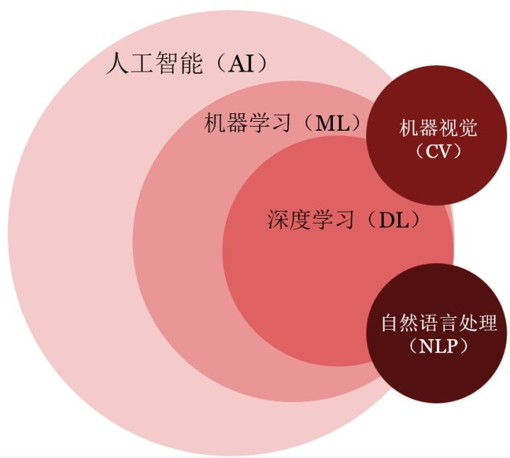
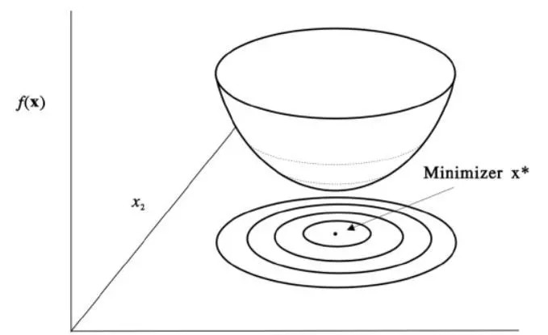
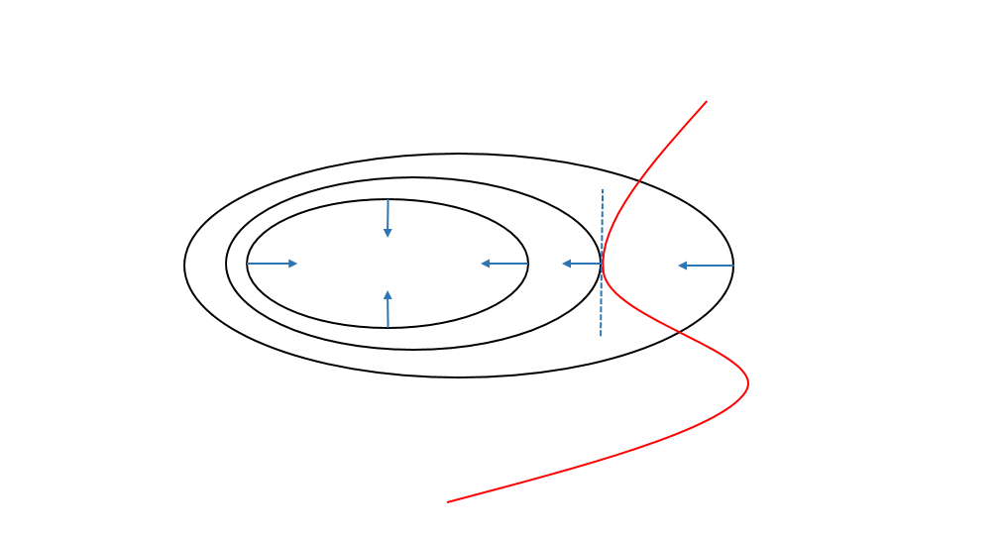
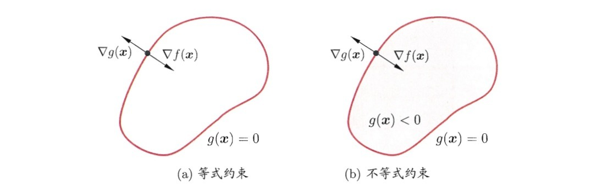

# 机器学习导论

## 概念：人工智能与机器学习[1]
> 人工智能涵盖了其他所有概念，而机器学习是人工智能的一个子方向，深度学习又是机器学习中的一类方法。至于机器视觉和自然语言处理，它们是人工智能领域的两个应用，而且往往会用到深度学习。

`Tom Mitchell`将机器学习任务定义为任务`Task`、训练过程`Training Experience`和模型性能`Performance`三个部分。
以分单引擎为例，我们可以将提高分单效率这个机器学习任务抽象地描述为：

> `Task`：提高分单效率 
> `Performance`：`DO`对的应答率/成交率 
> `Experience`: 不断给分单模型喂数据，让模型学习最佳的匹配参数  

## 研究内容 
广义的机器学习不仅包括有监督学习和无监督学习等基于海量数据的建模方法，还包括一系列在建模过程中提升模型准确率、降低降低模型复杂度和提高模型稳健性等的一系列方法，比如集成学习、强化学习、迁移学习和分布式学习等。  

#### 1.有监督学习
> 根据自变量和因变量数据的对应关系，生成一个函数构建从自变量到因变量的映射关系。

根据因变量是否离散，我们将有监督学习任务划分为“分类”学习任务和“回归”学习任务。
* “分类”学习算法包括朴素贝叶斯、决策树、支持向量机、逻辑回归等
* “回归”学习算法包括多项式回归、逐步回归、套索回归和岭回归等 
* 基于回归树的集成算法可以同时处理“分类”任务和“回归”任务，包括随机森林、`xgboost`和`lightgbm`等

#### 2.无监督学习
> 直接对输入的数据进行建模，主要包括“降维”学习任务和“聚类”学习任务

* “降维”算法包括因子分析、主成分分析、随机森林等
* “聚类”算法包括`k-means`聚类、层次聚类和密度聚类等

## 建模：从实际问题落地到公式和代码
#### 1.模型
记$$x_i \in R^d$$为$$d$$维训练数据集中的第$$i$$个样本，$$y_i$$为该样本对应的标签（离散值或者连续值，分别对应分类和回归学习任务），我们希望在给定$$x_i$$的情况下得到标签预测值$$y_i$$：
$$
\hat{y}_i=\sum_{j=1}^{d}w_jx_{ij}
$$
> 基本上模型都是从该线性模型发展而来的，比如逻辑回归模型就是将预测值变换为$$1/(1+exp(-\hat{y}_i))$$后根据阈值得到分类结果。

给出模型后，我们的训练目标就从模型本身转化为参数求解：
$$
\Theta=\{w_j|j=1,2,...,d\}
$$

#### 2.目标函数
> 目标函数是关于参数$$\Theta$$的函数，衡量了模型本身的性能表现`Performance`，最优化目标函数的过程就是参数求解的过程  

机器学习的目标函数可以是“损失函数”，也可以是“损失函数+正则化”

$$
\begin{aligned}
Obj(\Theta) &=L(\Theta)+\Omega(\Theta) \\
&=\sum_{i=1}^{n}l(y_i,\hat{y}_i) + \lambda \sum_{j=1}^{d}|w_j|^q
\end{aligned}
$$

其中损失函数度量损失值和真实值的误差，用于评判模型预测效果的优劣：
$$
\begin{aligned}
Square Loss &:l(y_i,\hat{y}_i)=(y_i-\hat{y}_i)^2 \\
LogisticLoss &: l(y_i,\hat{y}_i)=y_iln(1+e^{-\hat{y}_i})+(1-y_i)ln(1+e^{\hat{y}_i})
\end{aligned}
$$

正则化根据参数$$q$$阶长度给出了模型的复杂度，通过对参数向量增加某些规则从而缩小解空间，减少求出过拟合解的可能性：

$$
\begin{aligned}
L_1 &: \Omega(\Theta)= \lambda \sum_{j=1}^{d}|w_j| \\
L_2 &: \Omega(\Theta)= \lambda \sum_{j=1}^{d}|w_j|^2
\end{aligned}
$$

给出目标函数后，我们的训练目标就明确为目标函数$$Obj(\Theta)$$最小化。其中损失函数$$L(\Theta)$$控制模型$$bias$$，对应模型预测准确性；正则项$$\Omega(\Theta)$$控制模型$$variance$$，对应模型复杂度和稳健性。

## 最优化：最小化目标函数求解参数
#### 1.凸优化理论
> 指定义在凸集中的凸函数最优化的问题

1. 凸优化问题的局部最优解就是全局最优解
2. 很多非凸问题都可以被等价转化为凸优化问题或者被近似为凸优化问题（例如拉格朗日对偶问题）
3. 凸优化问题的研究较为成熟，当一个具体被归为一个凸优化问题，基本可以确定该问题是可被求解的

#### 2.无约束问题引入
无约束问题指的是目标函数对自变量取值没有任何限制，对应的最优化问题可以抽象为：
$$
\min_{x\in R^d} f(x)
$$
> 多元函数极值条件：多元函数各个分量的偏导数为0是极值点存在的必要条件，多元函数的海森矩阵（二阶偏导数方阵，描述了多元函数的局部曲率）为正定或负定是极值点存在的充分条件。

根据多元函数极值点存在的必要条件，我们可以令多元函数的各个分量偏导数为0求解所有可能的极值点，代入函数求解找到最小的极值点。  

当函数复杂到我们无法轻易求出潜在的极值点时，我们可以构造初始值$$x^{(0)}$$和递推公式不断逼近函数的极值点，比较典型的算法包括梯度下降法、坐标下降法和牛顿法等。

假设目标函数为线性回归的目标函数：
$$
h_\theta(x^{(i)})=\sum_{j=1}^{d} \theta_jx_j^{(i)}
$$
$$
J(\theta) = \frac{1}{2n}\sum_{i=1}^{n} (y^{(i)}-h_\theta(x^{(i)}))^2
$$
其中自变量维度为$$d$$,样本数为$$n$$, $$x_j^{(i)}$$表示第$$i$$个样本的第$$j$$个自变量的取值。

#### 3.梯度下降法
以批量梯度下降法为例，每一步我们都沿着目标函数的负梯度方向更新参数值:
$$
\frac{\partial J(\theta)}{\partial \theta_j}=-\frac{1}{n}\sum_{i=1}^{n}(y^{(i)})-h_\theta(x^{(i)}))x_j^{(i)}
$$
$$
\theta_j' = \theta_j+\frac{1}{n}\sum_{i=1}^{n}(y^{(i)}-h_\theta (x^{(i)}))
$$

#### 4.牛顿法
将多元函数展开为二阶泰勒展开式：
$$
f(X) = f(X^{(k)}) + 
\triangledown f(X^{(k)})^T \triangle X +
\frac{1}{2} \triangle X^T H(X^{(k)}) \triangle X +
...
$$
函数$$f(X)$$极值必要条件要求它必须是$$f(X)$$的驻点，即梯度向量为`$$0$$`：
$$
\triangledown f(X) = 0
$$
由于$$\triangledown f(X^{(k)})$$和$$H(X^{(k)}) = \triangledown ^2f(X^{(k)})$$ 分别表示函数$$f(X)$$的梯度和海森矩阵取值为$$X^{(k)}$$的实值向量和实值矩阵，我们分别将其记为$$g_k$$和$$H_k$$，根据驻点解出$$X^{(k+1)}$$：
$$
g_k + H_k(X-X^{(k)}) = 0
$$
$$
X^{(k+1)} = X^{(k)} - H_k^{-1}g_k
$$
同样我们可以构造一个迭代数列不停地去逼近函数的最小值点。

## 有约束的最优化问题

#### 1. 直观理解

上图中的多个黑色圆圈是二元函数$$f(x,y)$$投影在平面上的等高线（即同一条线代表函数值相同），蓝色的箭头代表函数的梯度方向（即函数值下降速度最快的方向）。如果在没有约束的情况下，我们应该直接沿着梯度方向找到使函数值不再下降的最小值，现在我们给函数加上了约束条件（即红色线，代表着$$(x,y)$$的取值要落在红线上）。  

> 现在问题转化为我们需要在红线上找到使得函数值最小化的$$(x,y)$$的取值。 

由于函数的等高线是密集的，因此我们只需要在满足函数等高线和约束曲线相切的点集合中寻找可能的极值点。（相切是极值点的必要非充分条件）

#### 2.转化为数学语言
由于在极值点处函数等高线和约束函数的梯度都与切平面垂直，从而他们的梯度方向在同一条直线上，即：
* 对于约束曲面上的任意点$$(x,y)$$，该点的梯度$$\triangledown h(x,y)$$正交于约束曲面
* 在最优点处，目标函数在该点的梯度$$\triangledown f(x,y)$$正交于约束曲面
$$
\triangledown f(x,y) = \lambda \triangledown h(x,y)
$$
我们定义拉格朗日函数如下，其中$$\lambda$$称为拉格朗日乘子：
$$
L(x,y,\lambda) = f(x,y) + \lambda h(x,y)
$$
我们将拉格朗日函数求偏导之后就得到上述的梯度公式，因此我们可以将原约束优化问题转化为对拉格朗日函数$$L(x,y,\lambda)$$的无约束优化问题。

#### 3.从等式约束到非等式约束

下图展示了拉格朗日乘子法的几何含义：在左边的等式约束($$g(x)=0$$)下和右边的不等式约束$$g(x)\leq 0$$下最小化目标函数$$f(x,y)$$。其中红色曲线表示$$g(x)=0$$围成的曲面。

不等于约束$$g(x)\leq 0$$的情形中，最优点$$x^*$$要么出现在边界$$g(x) = 0$$上，要么出现在区域$$g(x)<0$$中：
* 对于$$g(x)<0$$的情形，因为$$\triangledown f(x)$$方向向里，因此约束条件$$g(x)\leq 0$$不起作用，我们只需要通过条件$$\triangledown f(x) = 0$$求得可能的极值即可。
* $$g(x)=0$$的约束类似于前面提到的等式约束，但是$$\triangledown f(x^*)$$的方向和$$g(x^*)$$必须相反，即存在常数$$\lambda > 0$$使得$$\triangledown f(x^*) + \lambda \triangledown g(x^*)=0$

> 当最优值落在$$g(x)<0$$区域时，约束条件件$$g(x)\leq 0$$不起作用，因此我们令约束条件的乘子$$\lambda =0$$；当最优值落在$$g(x)=0$$边界上时，$$\lambda g(x)$$自然等于0。考虑到这两种情形，我们可以推出$$\lambda g(x)=0$$。

因此，拉格朗日乘子法可以写成如下的等价形式，括号的条件也叫做`KKT`条件。
$$
L(x,\lambda) = f(x) + \lambda g(x)
$$
$$
\left\{\begin{matrix}
g(x)\leq 0\\ 
\lambda \geq 0\\ 
\lambda g(x) = 0
\end{matrix}\right.
$$

#### 4.拉格朗日法的一般写法
考虑具有$$m$$个等式约束和$$n$$个不等式约束的一般优化情形：
$$
\min_{x} f(x)
$$
$$
\left\{\begin{matrix}
h_i(x) = 0 \quad (i=1,2,...,m)\\
g_j(x) \leq 0 \quad (j=1,2,...,n)
\end{matrix}\right.
$$

引入拉格朗日乘子$$\lambda = (\lambda_1, \lambda_2,...,\lambda_m)^T$$和$$\mu=(\mu_1,\mu_2,...,\mu_n)^T$$，对应的拉格朗日函数为：
$$
L(x,\lambda,\mu)=f(x)+\sum_{i=1}^{m} \lambda_i h_i(x)+\sum_{j=1}^{n}\mu_jg_j(x)
$$
不等式问题对应的`KKT`条件为：
$$
\left\{\begin{matrix}
g_j(x) \leq 0 \\
\mu_j \geq 0\\
\mu_j g_j(x) = 0
\end{matrix}\right.
$$

#### 5.拉格朗日对偶性
通过拉格朗日对偶性，我们可以将主问题转化为凸函数性质的对偶问题，而凸优化问题相对而言是易于求解的。

## Reference
[1] https://www.zhihu.com/question/294147625/answer/490538339

[2] https://homes.cs.washington.edu/~tqchen/pdf/BoostedTree.pdf

[3] https://www.jianshu.com/p/c922a3263e3a  