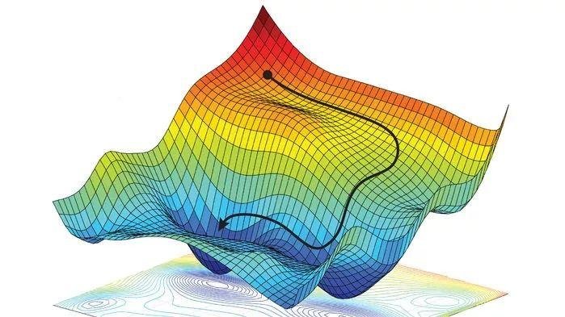

# 梯度下降法

## 前言
梯度下降法`gradient descent`是求解无约束最优化问题的一种最常用的方法，它是一种迭代算法，每一步需要求解目标函数的梯度向量。

## 问题抽象
$$f(x)$$是$$R^n$$上具有一阶连续偏导数的函数，要求解的无约束问题是:$$\min f(x), x\in R^n$$， 其中$$x^*$$表示目标函数$$f(x)$$的极小值点

## 关键概念
* 迭代：选取适当初始值$$x^{(0)}$$，不断迭代更新$$x$$的 值，直至收敛
* 梯度下降：负梯度方向是使函数值下降最快的方向，我们在迭代的每一步都以负梯度方向更新$$x$$的值
* 收敛：给定一个精度$$\epsilon$$，在迭代的每一轮根据梯度函数$$g(x)=\triangledown f(x)$$计算梯度$$g_k=f(x^k)$$，$$||g_k||<\epsilon$$时认为收敛
* 学习率：也叫做步长，表示在每一步迭代中沿着负梯度方向前进的距离

## 直观理解
以下图为例，开始时我们处于黑色圆点的初始值（记为$$x^{(0)}$$），我们需要尽快找到函数的最小值点，最快的方法就是沿着坡度最陡的方向往下走。

## 算法细节
由于$$f(x)$$具有一阶连续导函数，若第$$k$$次迭代值为$$x^{(k)}$$，则可将$$f(x)$$在$$x^{(k)}$$附近进行一阶泰勒展开：
$$
f(x)=f(x^{(k)})+g_k^T(x-x^{(k)})
$$
其中$$g_k=g(x^{(k)})=\triangledown f(x^{(k)})$$在$$x^{(k)}$$的梯度。 
接着我们求出第$$k+1$$次的迭代值$$x^{(k+1)}$$:
$$
x^{(k+1)}\leftarrow x^{(k)}+\lambda_kp_k
$$
其中$$p_k$$是搜索方向，取负梯度方向$$p_k=-\triangledown f(x^{(k)})$$，$$\lambda_k$$是步长，需满足：
$$
f(x^{(k)}+\lambda_kp_k)=\min_{\lambda\geq0}f(x^{(k)}+\lambda p_k)
$$

## 算法实现
* **输入**：目标函数$$f(x)$$，梯度函数$$g(x)=\triangledown f(x)$$，计算精度$$\epsilon$$
* **输出**：$$f(x)$$的极小值点$$x^*$$
* **步骤**:
1. 取初始值$$x^{(0)}\in R^n$$，置$$k$$为$$0$$
2. 计算$$f(x^{(k)})$$
3. 计算梯度$$g_k=g(x^{(k)})$$，当$$||g_k||<\epsilon$$时停止迭代，令$$x^*=x^{(k)}$$;否则，令$$p_k=-g(x^{(k)})$$，求$$\lambda_k$$，使$$f(x^{(k)}+\lambda_kp_k)=\min_{\lambda \geq0}f(x^{(k)}+\lambda p_k)$$
4. 令$$x^{(k+1)} \leftarrow x^{(k)}+\lambda_k p_k$$，计算$$f(x^{(k+1)})$$，当$$|f(x^{(k+1)})-f(x^{(k)})|<\epsilon$$或$$|x^{x(k+1)-x^{(k)}}|<\epsilon$$时停止迭代，令$$x^*=x^{(k+1)}$$
5. 否则，令$$k=k+1$$，回到步骤3

## 算法调优
* 学习率：学习率太小时收敛过慢，但太大时又会偏离最优解
* 初始值：当损失函数是凸函数时，梯度下降法得到的解是全局最优解；当损失函数是非凸函数时，得到的解可能是局部最优解，需要随机选取初始值并在多个局部最优解之间比较
* 归一化：如果不归一化，会收敛得比较慢，典型的情况就是出现“之”字型的收敛路径

## 注意事项
* 当目标函数是凸函数时，梯度下降法是全局的最优解，一般情况下梯度下降法的解不一定是全局最优解
* 梯度下降法的收敛速度未必是最快的
