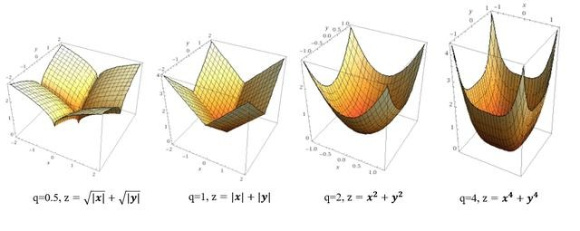
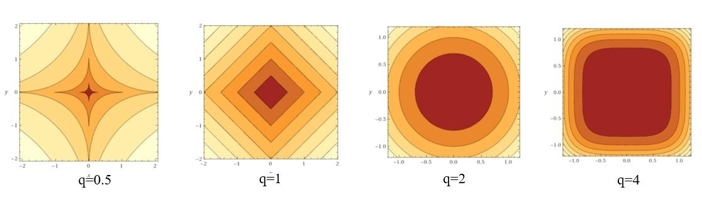

# 正则化

## 综述
机器学习中经常会在损失函数中加入正则项，称之为正则化`Regularize`。

**目的**：防止模型过拟合

**原理**：在损失函数上加上某些规则（限制），缩小解空间，从而减少求出过拟合解的可能性

**例子**：以最简单的线性模型为例

$$
y=X\beta + \epsilon
$$
我们在统计学习中接触到的**最小二乘估计**利用均方误差最小的原则来进行参数估计：

$$
\hat{\beta}=arg \min_{\beta}||y-X\beta||^2
$$
在最小二乘估计中加入$$L2$$正则项后，我们得到岭估计：

$$
\tilde{\beta}=arg\min_{\beta}||y-X\beta||^2+\lambda||\beta||^2
$$
在数学上我们可以证明岭估计的参数模要严格小于最小二乘估计的参数模，换句话说，我们可以认为加入$$L2$$正则项后，估计参数长度变短了，这在数学上被称为特征缩减`shrinkage`。

> `shrinkage`方法介绍：指训练求解参数过程中考虑到系数的大小，通过设置惩罚系数，使得影响较小的特征的系数衰减到$$0$$，只保留重要特征的从而减少模型复杂度进而达到规避过拟合的目的。常用的`shinkage`的方法有`Lasso`（$$L1$$正则化）和岭回归（$$L2$$正则化）等。 
> 采用`shrinkage`方法的主要目的包括两个：一方面因为模型可能考虑到很多没必要的特征，这些特征对于模型来说就是噪声，`shrinkage`可以通过消除噪声从而减少模型复杂度；另一方面模型特征存在多重共线性（变量之间相互关联）的话可能导致模型多解，而多解模型的一个解往往不能反映模型的真实情况，`shrinkage`可以消除关联的特征提高模型稳定性。

## 通过线性模型理解正则化
对于包括多元线性回归模型、逻辑回归和`SVM`在内的线性模型，我们需要利用测试集来最小化损失函数从而求得模型参数$$w$$:

$$
E(w)=\frac{1}{2}\sum_{i=1}^{N}\{y_i-w^T\phi(x_i)\}^2
$$
我们在线性模型的损失函数中加入正则项可以得到目标函数。其中$$\lambda$$被称为正则化系数，当$$\lambda$$越大时，正则化约束越强。

$$
\frac{1}{2}\sum_{i=1}^{N}\{y_i-w^T\phi(x_i)\}^2+\frac{\lambda}{2}w^Tw
$$
通过令目标函数导函数为$$0$$，我们可以得到参数的表达式为：

$$
w=(\lambda I+\Phi^T\Phi)^{-1}\Phi^TY
$$
## 选择L2正则项的原因
给损失函数加上的正则化项可以有多种形式，下面给出了正则化的一般形式：
$$
\frac{1}{2} \sum_{i=1}^{N}{y_i-w^T\phi(x_i)}^2+\frac{\lambda}{2}\sum_{i=1}{M}
|w_j|^q
$$
其中$$M$$是参数的个数，也是模型特征的维数；$$q$$是正则项的阶数，$$L2$$正则项的$$q$$为$$2$$。
考虑到在高维数据下很难给出正则项的几何意义，我们假设数据源只有两个特征：
$$
x = \{x_1, x_2\}, w= \{w_1,w_2\}
$$
$$q$$不同取值时正则项的函数值图像：

不同函数值图像对应的等高线（即俯视图）为： 

最小化目标函数时，可以看做在控制损失函数不变的情况时令正则项最小化，几何意义如下所示：蓝色圈表示没有限制的损失函数随着$$w$$迭代寻找着最小化的过程的$$E(w)$$函数等高线（同个圆上的损失函数值相同），蓝色圈和橙色圈之和就是目标函数值，目标函数最小化的点往往出现在蓝圈和橙圈相交的点即目标函数最小化的参数值$$w^*$$。 

可以看到，$$ L1 $$正则化的最优参数值$$ w^* $$恰好是$$ w_1=0 $$的时候，意味着我们剔除了模型中一个特征（系数为$$0$$等价于剔除该特征），从而达到了降低模型复杂度的目的。在这个意义上$$ L1 $$正则化效果要优于$$ L2 $$正则化，但$$ L1 $$存在拐点不是处处可微，从而$$ L2 $$正则化有更好的求解特性。

## 总结

梳理一下，正则化有多种方式，包括$$ L0 $$（向量中非零元素个数），$$ L1 $$（向量中元素绝对值之和），$$ L2 $$（向量的模）。但是$$ L0 $$范数的求解是个NP完全问题，而$$ L1 $$也能实现稀疏并且比$$ L0 $$有更好的优化求解特性而被广泛应用。

$$ L2 $$范数指各元素平方和后开根的值，可令$$ w $$每个元素接近于0，虽然不如$$ L1 $$更彻底地降低模型复杂度，但是由于处处可微降低了计算难度。

