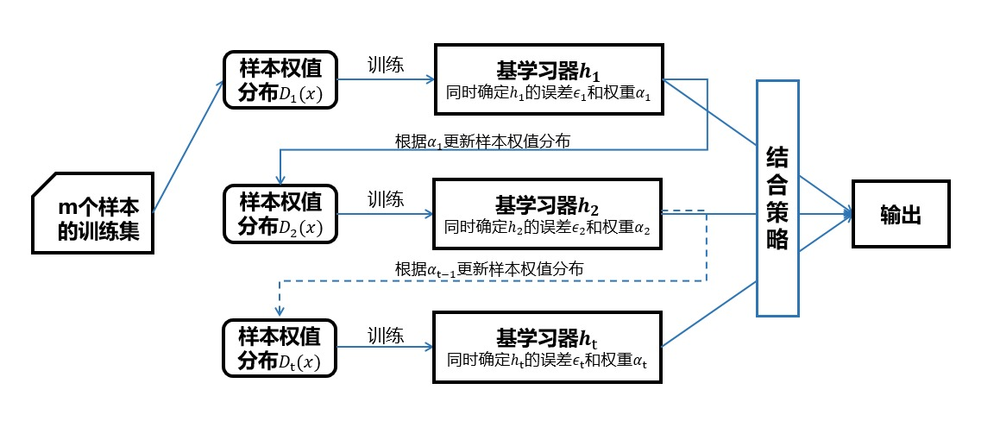
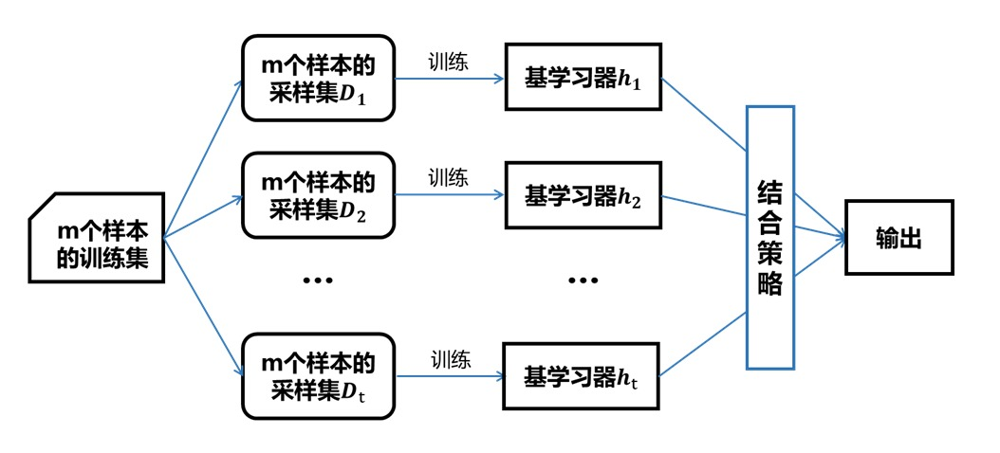

# 集成学习

## 集成学习的概念
集成学习指先产生一组弱学习器`week learner`（指泛化性能略优于随机猜测的学习器），随后根据某种策略将这些弱学习器组合起来得到最终预测结果的方法。

## 集成学习提升模型性能的原理
先考虑一个简单的例子： 在二分类任务中，假设三个分类器在三个测试样本上的表现如下所示，集成的结果通过投票法产生

#### 1. 集成提升性能

每个分类器的精度为66.6%，集成结果提升了模型性能：

| 分类器 | 测试用例1 | 测试用例2 | 测试用例3 |
| ------ | --------- | --------- | --------- |
| h1     | √         | √         | ×         |
| h2     | ×         | √         | √         |
| h3     | √         | ×         | √         |
| 集成   | √         | √         | √         |

#### 2. 集成不起作用

每个分类器的精度为也为66.6%，但彼此之间没有差别，集成不起作用：

| 分类器 | 测试用例1 | 测试用例2 | 测试用例3 |
| ------ | --------- | --------- | --------- |
| h1     | √         | √         | ×         |
| h2     | √         | √         | ×         |
| h3     | √         | √         | ×         |
| 集成   | √         | √         | ×         |

#### 3. 集成起负作用

每个分类器的精度只有33.3%，集成结果反而更差：

| 分类器 | 测试用例1 | 测试用例2 | 测试用例3 |
| ------ | --------- | --------- | --------- |
| h1     | √         | ×         | ×         |
| h2     | ×         | √         | ×         |
| h3     | ×         | ×         | √         |
| 集成   | ×         | ×         | ×         |

#### 4. 结论

集成的结果揭示：要想形成好的集成，个体学习器应“好而不同”。**即个体学习器要有一定的精度，同时不同学习器之间应该有差异**。

## 数学验证
考虑二分类问题$$y\in\{-1,+1\}$$和真实函数$$f$$，假设基分类器的错误率为$$\epsilon$$，即对每个基分类器$$h_i$$有：
$$
P(h_i(x)\neq f(x))=\epsilon
$$
假设我们构建了$$T$$个基分类器，若有超过半数的基分类器正确则集成分类器正确：
$$
H(x)=sign(\sum_{i=1}^{T}h_i(x))
$$
假设基分类器的错误率独立，那么由`Hoeffding`不等式，集成的错误率为：

$$
P(H(x)\neq f(x))=\sum_{k=0}^{[T/2]}\binom{T}{k}(1-\epsilon)^k{\epsilon}^{T-k}\leq exp(-\frac{1}{2}T(1-2\epsilon)^2)
$$
即随着个体分类器数目$$T$$不断增大，集成的错误率将指数下降。
> 需要注意的是，在上述的推导中我们假设个体分类器的错误率是相互独立的，但是现实中个体学习器是针对同一个问题训练出来的，他们显然不可能独立。

## 集成学习的分类
目前集成学习方法大致可以分为两类：一类是个体学习器间存在强依赖关系、必须串行生成的序列化方法，比如`Boosting`；另一类是个体学习器间不存在强依赖关系、可同时生成的并行化方法，比如`Bagging`和随机森林。
#### 1. Boosting
`Boosting`指的是先从初始训练集训练出一个基学习器，再根据基学习器的表现对训练样本分布进行调整，使得先前基学习器做错的训练样本在后续得到更多关注，然后基于调整后的样本分布来训练下一个基学习器，最终将获得的T个基学习器加权组合。 
`Boosting`族中最著名的代表即`AdaBoost`算法和提升树算法`boosting tree`。

#### 2. Bagging
为使获得的基学习器有较大的差异，我们可以将训练集划分为不同的数据子集，再从每个数据子集中训练一个基学习器，然而这种方法会使得每个基学习器只使用到一部分训练数据，甚至达不到有效学习的要求，这显然无法确保产生出比较好的基学习器。**因此我们考虑使用相互有交集的采样子集**。 
`Bagging`方法采用自助采样法`boostrap sampling`，即我们通过有放回随机抽样的方法从包含$$m$$个样本的训练集中抽取$$m$$个样本。其中每轮采样初始训练集中约有$$63.2\%$$的样本出现在采样集中。

## 结合策略
假设我们得到了$$T$$个基学习器$$\{h_1,h_2,...h_T\}$$，常用的结合策略包括：  
#### 1.平均法
对于数值型输出最常见的结合策略即平均法：

$$
H(x)=\sum_{i=1}^{T}w_ih_i(x)
$$
#### 2.投票法
对于分类任务而言，学习器给出的预测结果是一个标记，最常见的结合策略即投票法。
#### 3.学习法
当训练数据很多时，一种更为强大的结合策略是使用“学习法”，即通过一个新的学习器来结合基学习器预测的结果。`Stacking`是学习法的典型代表，我们将基学习器称为初级学习器，用于结合的学习器称为次级学习器或者元学习器。  
`Stacking`先从初始数据集训练出初级学习器，然后利用新数据集用于训练次级学习器(直接使用初级学习器的训练集会有过拟合的风险)，并且在次级学习器的训练过程中，初级学习器的输出被当做次级学习器的输入。