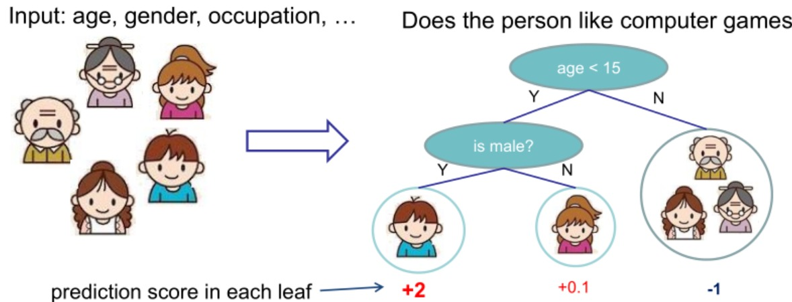
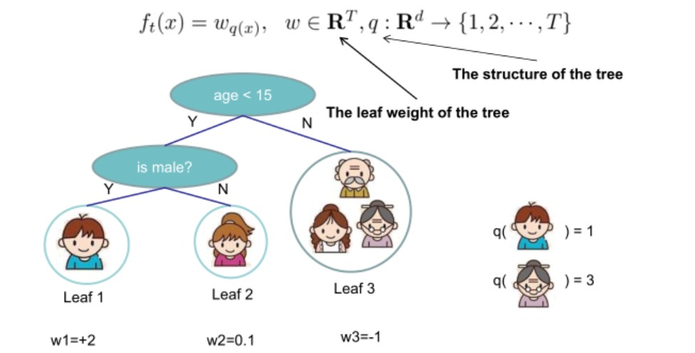

# XGBoost

## 简介
`XGBoost`算法是以`CART`为基分类器的集成学习方法之一，由于其出色的运算效率和预测准确率在数据建模比赛中得到广泛的应用。与随机森林赋予每一颗决策树相同的投票权重不同，`XGBoost`算法中下一棵决策树的生成和前一棵决策树的训练和预测相关（通过对上一轮决策树训练准确率较低的样本赋予更高的学习权重来提高模型准确率）。相比于其他集成学习算法，`XGBoost`一方面通过引入正则项和列抽样的方法提高了模型稳健性，另一方面又在每棵树选择分裂点的时候采取并行化策略从而极大提高了模型运行的速度。

## 需要提前了解的知识
> 关于`XGBoost`本身的原理及相关知识，陈天奇的课件已经写得很完善了，只不过我一直都喜欢将他人的知识用自己的语言阐述从而内化吸收的笨方法。

#### 1. 监督学习的相关概念
监督学习简单理解就是研究自带训练标签的数据，通过构造一个目标函数来描述自变量和因变量的映射关系。其中目标函数可抽象为训练误差$$L(\Theta)$$和正则项$$\Omega(\Theta)$$之和：
$$
\begin{aligned}
Obj(\Theta) &= L(\Theta) + \Omega(\Theta) \\
&= \sum_{i=1}^{n}l(y_i, \hat y_i) + \lambda||w||^q
\end{aligned}
$$
> 其中$$l(y_i, \hat y_i)$$叫做损失函数，衡量了预测值和真实值的偏差程度；$$\lambda||w||^q$$叫做正则项，$$q$$取值一般为$$1$$（$$L1$$正则项）或者$$2$$（$$L2$$正则项）。

#### 2. 分类与回归树`CART`
`CART`树本身的原理我在此前的文章已经阐述地比较清楚了，这里不再赘述。

[决策树引论和CART算法](https://zhuanlan.zhihu.com/p/70776194)

#### 3. 泰勒展开式
> 当$$ f(x) $$在$$ x=x_0 $$处具有$$ n $$阶连续导数，我们可以用$$ x-x_0 $$的$$ n $$次多项式逼近函数  

公式：
$$
f(x) = \frac{f(x_0)}{0!}+\frac{f'(x_0)}{1!}(x-x_0)+\frac{f''(x_0)}{2!}(x-x_0)^2+...+\frac{f^{(n)}(x_0)}{n!}(x-x_0)^n+R^n(x)
$$
其中$$ R^n(x) $$表示泰勒余项，它是$$ (x-x_0)^n $$的高阶无穷小。

## 模型建立与目标函数
`XGBoost`本身属于监督学习，假设`XGBoost`模型本身由$$K$$棵`CART`构成，那么模型可表示如下，其中$$f_k$$表示第$$k$$棵树，$$f_k(x_i)$$表示第$$i$$个样本在第$$k$$棵树的得分：
$$
\hat y_i = \sum_{i=1}^{K} f_k(x_i)
$$

需要注意的是，`XGBoost`中基分类树每个叶子节点都会给出对应的得分，通过加总多棵树的得分实现集成学习。下图以“一个人是否喜欢玩电脑游戏”展示了多棵树如何进行预测（预测分值越高表示越喜欢玩游戏）：

同大部分机器学习模型一样，`XGBoost`的目标函数也能表示为损失函数和正则项之和，分别控制模型的准确度和复杂度（这两者往往难以同时最优化，需要进行权衡）：
$$
\begin{aligned}
Obj(\Theta) &= L(\Theta) + \Omega(\Theta) \\
&= \sum_{i=1}^{n}l(y_i, \hat y_i) + \sum_{k=1}^{K} \Omega(f_k)
\end{aligned}
$$

## 参数优化思路
按照机器学习的思路，给出具体的目标函数之后就是参数求解的过程（通过求解参数表达式使损失函数最小化）。由于$$\hat y_i=f_k(x_i)$$，`XGBoost`模型的参数$$\Theta$$即$$K$$棵`CART`树组成的向量:
$$
\Theta = \{f_1, f_2,...,f_K\}
$$
模型的损失函数值$$L(\Theta)$$越小表明模型的拟合效果越佳，正则项$$\Omega(\Theta)$$越小表明模型的复杂度越低，因此我们的目的就是最小化目标函数$$Obj(\Theta)$$从而求解出参数向量$$\Theta$$。 
接下来就是如何描述一棵树$$f_k$$的问题，要确定一棵树需要如下两方面的内容：

* 树的结构，即将样本映射到不同叶子节点的函数
* 各个叶子节点的分数

在不清楚每棵树的具体结构情况下，直接最优化目标函数是不可能的，`XGBoost`利用加法模型简化模型目标函数，在前一棵`CART`基础上训练下一棵决策树：
$$
\hat y_i^{(0)} = 0
$$
$$
\hat y_i^{(1)} = \hat y_i^{(0)} + f_1(x_i)
$$
$$
\hat y_i^{(2)} = f_1(x_i) + f_2(x_i) = \hat y_i^{(1)} + f_2(x_i)
$$
$$
...
$$
$$
\hat y_i^{(K)} = \sum_{k=1}^{K} = \hat y_i^{(K-1)} + f_K(x_i)
$$

## 参数估计
将目标函数最优化的过程通过贪心算法的思想转化为$$K$$轮迭代，其中第$$t$$轮迭代时的目标函数可表示为：
$$
\begin{aligned}
Obj^{(t)}(\Theta) &= \sum_{i=1}^{n}l(y_i,\hat y_i^{(t)}) + \sum_{k=1}^{t} \Omega(f_k) \\
&= \sum_{i=1}^{n}l(y_i,\hat y_i^{(t-1)}+f_t(x_i)) + \Omega(f_t) + \sum_{k=1}^{t-1}\Omega(f_k) \\
&= \sum_{i=1}^{n}l(y_i,\hat y_i^{(t-1)}+f_t(x_i)) + \Omega(f_t) + constant
\end{aligned}
$$
考虑以均方误差作为损失函数，我们可以将目标函数表示为：
$$
\begin{aligned}
Obj^{(t)}(\Theta) &= \sum_{i=1}^{n}\Big (y_i - (\hat y_i^{(t-1)} + f_t(x_i))\Big )^2 + \Omega(f_t) + constant \\
&= \sum_{i=1}^{n}\Big[ 2(\hat y_i^{(t-1)} - y_i) f_t(x_i) + f_t(x_i)^2 \Big] + \Omega(f_t) + constant
\end{aligned}
$$
仔细观察上述这个式子，由于求解$$Obj^{(t)}(\Theta)$$时前一棵树$$f_{t-1}$$是已知的，因此$$\hat y_i^{(t-1)}$$也就是常量。因此$$Obj^{(t)}(\Theta)$$就是关于$$f_t(x_i)$$的二次表达式，为后续的参数求解提供便利。

> $$f_t(\cdot)$$就是第$$t$$棵树由样本集到叶子节点的映射函数，$$f_t(x_i)$$就是样本对应的某个叶子节点的分数值。

在机器学习竞赛中用过`XGBoost`的小伙伴肯定还知道该算法可以自定义损失函数，对于一般的损失函数，我们人为定义损失函数一阶微分和二阶微分：
$$
g_i = \partial_{\hat y^{(t-1)}}l(y_i, \hat y^{(t-1)})
$$
$$
h_i = \partial^2_{\hat y^{(t-1)}} l(y_i, \hat y^{(t-1)})
$$

利用泰勒展开式我们可以把目标函数近似化简为：
$$
\begin{aligned}
Obj^{(t)}(\Theta) &\approx \sum_{i=1}^{n} \Big[ l(y_i, \hat y_i^{(t-1)}) + g_if_t(x_i)  + \frac{1}{2} h_if_t^2(x_i)\Big] + \Omega(f_t) + constant \\
&= \sum_{i=1}^{n} \Big[ g_if_t(x_i) + \frac{1}{2}h_if_t^2(x_i) \Big] + \Omega(f_t) + constant
\end{aligned}
$$

之前我们提到一棵树$$f_t(\cdot)$$可由它的结构（即样本到叶子节点的映射函数）和每个叶子节点上的分数唯一确定，现在我们给出第$$t(1\leq t \leq K)$$棵树的描述函数：
$$
f_t(x) = w_{q(x)}, w\in R^T, q:R^d \rightarrow\{1,2,...,T\}
$$
其中$$q(\cdot)$$表示树的结构，$$w$$表示每个叶子节点的分数的$$T$$维向量，$$d$$和$$T$$分别表示训练数据集特征维度和叶子节点数。

我们再定义树的复杂度$$\Omega(f_t)$$为：
$$
\Omega(f_t) = \gamma T + \frac{1}{2} \lambda \sum_{j=1}^{T} w_j^2
$$
> 上式出现的$$\gamma$$和$$\lambda$$都是自定义惩罚系数，前者用于控制叶子节点的个数，后者用于控制参数向量的模，两者都是在约束`CART`的复杂度。

代入$$f_t(x)$$的定义到目标函数中，再定义映射到叶子节点$$j(1\leq j \leq T)$$的样本集合为$$I_j = \{ i| q(x)=j \}$$：
$$
\begin{aligned}
Obj^{(t)} &\approx \sum_{i=1}^{n} \Big[ g_if_t(x_i) + \frac{1}{2}h_if_t^2(x_i) \Big] + \Omega(f_t) \\
&= \sum_{i=1}^{n} \Big[ g_iw_{q(x)} + \frac{1}{2} h_iw^2_{q(x_i)} \Big] + \gamma T +\lambda \frac{1}{2}\sum_{j=1}^{T}w_j^2 \\
&= \sum_{j=1}^{T} \Big[ (\sum_{i\in I_j}g_i)w_j + \frac{1}{2}(\sum_{i\in I_j} h_i + \lambda)w_j^2 \Big] + \gamma T
\end{aligned}
$$

每一轮迭代中$$g_i(1\leq i \leq n)$$和$$h_i(1\leq i \leq n)$$在给定损失函数下都相当于是常量，其中$$n$$表示训练集样本量，我们人为定义$$G_j = \sum_{i\in I_j}g_i$$和$$H_j = \sum_{i\in I_j}h_i$$再一次精简一下目标函数：
$$
\begin{aligned}
Obj^{(t)} &= \sum_{j=1}^T \Big[ (\sum_{i\in I_j}g_i)w_j + \frac{1}{2}(\sum_{i \in I_j} h_i + \lambda) w_j^2 \Big] + \gamma T \\
&= \sum_{j=1}^T \Big[ G_jw_j + \frac{1}{2}(H_j + \lambda)w_j^2 \Big] + \gamma T 
\end{aligned}
$$

基于二次函数最优化，我们可以求解出参数和目标函数的最优值：
$$
w_j^* = -\frac{G_j}{H_j + \lambda}
$$
$$
Obj = -\frac{1}{2} \sum_{j=1}^{T} \frac{G_j^2}{H_j + \lambda} + \gamma T
$$

## 如何确定树的复杂度
在上一步参数估计中，我们构造了映射到第$$j$$个叶子节点的样本集合$$I_j = \{i | q(x_i) = j\}$$，这相当于我们在已知每棵树结构的基础上进行参数估计。 

当特征维度较大时，树的结构难以穷尽，因此`XGBoost`借助普通决策树的贪心算法思路求解“最优”的结构，即从深度为$$0$$开始，每次`split`对目标函数的影响为：
$$
Gain = \frac{1}{2} \Big[ \frac{G_L^2}{H_L + \lambda} + \frac{G_R^2}{H_R + \lambda} - \frac{(G_L+G_R)^2}{H_L+H_R + \lambda} \Big] - \gamma
$$
中括号内第一部分表示`split`后左叶子节点的得分，第二部分表示右叶子节点的得分，第三部分表示不进行`split`的得分。$$\gamma$$是我们引入的复杂度惩罚因子，衡量了额外叶子节点带来的复杂度损失。 

自此求解最优树结构的思想和`CART`几乎一致，这里便不再赘述。求解完树结构后，根据前面参数估计的内容我们可以很方便地给出来每个叶子节点的权重。

## Reference
[1] https://xgboost.readthedocs.io/en/latest/tutorials/model.html