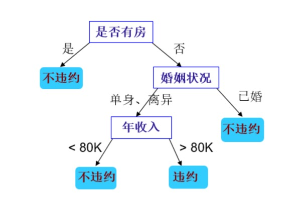
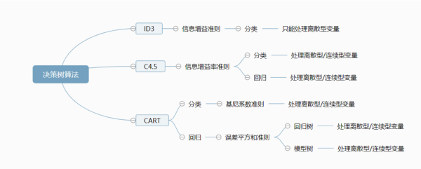
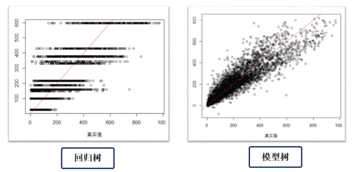

# 决策树引论和CART算法

## 决策树综述
#### 1. 决策树的工作原理
决策树`decision tree`分类法是一种简单但广泛使用的分类技术。以是否贷款违约的二分类问题为例，当我们希望根据给定的训练集习得一个模型对新出现的贷款人进行分类时，经常需要从大量的贷款申请单中识别出来哪些贷款人是劣质的贷款人（容易拖欠贷款）。想象一下客户经理和助手针对一个贷款者进行的如下对话：
>经理：他有房吗？ 
>助手：没有 
>经理：他结婚了吗？ 
>助手：没有，一个单身汉 
>经理：他年收入高于70K吗？
>助手：不足70K 
>经理：那驳回他的申请  

经理根据贷款者的各方面“特征”一步步分析后进行的多次决策就相当于一个简单的决策树过程。下面我们用一个决策树模型模拟经理的决策过程。

#### 2. 决策树的构成
决策树是一种由节点和有向边组成的层次结构，树中包含三种节点：

* **根节点`root node`**：它没有入边，但有零条或多条出边，是决策树首次划分的节点。
* **内部节点`internal node`**：恰有一条入边和两条或多条出边。
* **叶子节点`left node`**：恰有一条入边但没有出边。每个叶子节点都被赋予一个类标签。

#### 3. 如何建立决策树模型
机器学习中，决策树是一个预测模型，代表着的是对象属性与对象值之间的一种映射关系。树中每个节点表示某个对象，而每个分叉路径则代表的某个可能的属性值，而每个叶节点则对应从根节点到该叶节点所经历的路径所表示的对象的值。机器学习中的经典决策树算法包括`ID3`，`C4.5`和`CART`等，但最基本的原理都是一样的。 

理论上讲，对于给定的属性集可以构造的决策树数目达到指数级，尽管某些决策树比其他决策树更加准备，**但是由于搜索空间是指数规模的，找出最佳决策树在计算上是不可行的**。**尽管如此，人们还是开发了一些有效的算法能够在合理的时间内构造出具有一定准确率的次最优决策树**。 

这些算法通常采用贪心策略，在选择划分数据的属性时，采取一系列局部最优决策来构造决策树，**`Hunt`算法就是这样一种算法，它是包括`ID3`、`C4.5`和`CART`在内算法的基础**。

#### 4. 决策树的发展:Hunt-ID3-C4.5-CART
虽然基于多棵弱决策树的`Bagging`、`Random Forest`和`Boosting`等`Tree ensemble`模型更加普遍且准确率更优，但是“完全生长”的决策树由于其简单直观的特性具有广泛的应用。除此之外，想要掌握`Tree ensemble`模型也绕不开组成其的弱分类树原理。 
一般而言，一棵“完全生长”的决策树包括**特征选择、决策树构建和剪枝**三个过程。在`Hunt`算法的基础上，决策树算法发展出较为流行的`ID3`、`C4.5`和`CART`算法，同样这些算法都是基于启发式的贪心算法简历的，并不能保证建立全局最优的决策树。 

我们这里**简单介绍三种决策树算法**：

* `ID3`决策树**按照“最大信息增益”原则选择最优划分特征**（特征一经划分在之后的过程中不再参与划分），然后按照该**特征的所有取值划分数据集**。**缺点是会优先选择属性值较多的特征（该特征信息增益较大）；不能处理属性值是连续型变量的特征。**
* `C4.5`算法：在`ID3`算法基础上使用信息增益率`gain ratio`替代信息增益`information gain`。**缺点：信息增益率会优先选择可取值数目较少的属性，并且对于连续属性需要扫描排序，性能不佳。**
* `CART`算法：`CART`使用基尼系数`Gini index`来选择划分属性，并且采用**二分递归分割技术**生成结构简洁的二叉树，同时`CART`既能处理分类问题又能处理回归问题。

> 关于决策树的各种算法的细节会在决策树部分详细介绍，本文只介绍`CART`决策树。

## CART决策树特点
`CART`树全称是`Classification and Regression Tree`。递归地将当前数据集分割为两个子数据集，形成一棵二叉树。**`CART`既能处理连续型变量又能处理离散型变量，利用训练数据递归的划分特征空间进行决策树构造，用验证集进行剪枝**。

* 二叉树：内部节点属性取值分为“是”（归到左分支）和“否”（归到右分支）。一般而言，二叉树的精度会高于多叉树。
* 组成：特征选择、树生成和剪枝
* 适用：既可用于分类也可用于回归
* 特征选择标准：`Gini`系数。对于离散型属性选择该属性产生最小`Gini` 系数的子集作为分裂子集；对于连续型属性考虑所有可能的分裂点。

## CART分类树（输出为离散型变量）
#### 1.算法

**输入**：训练数据集$$D$$，停止计算的条件 
**输出**：`CART`决策树 
**算法**：根据训练数据集$$D$$，从根节点开始，递归地对每个节点进行如下操作，构建二叉决策树

* 设当前节点的训练数据集为$$D$$，计算每个现有属性$$A$$对该数据集$$D$$的$$Gini$$系数。同时，对每个属性$$A$$的每个可能取值$$a$$，根据样本对$$A=a$$的测试为“是”或“否”将$$D$$二分为$$D1$$、$$D2$$两个部分，计算$$Gini(D_1)$$和$$Gini(D_2)$$后加权得到$$A=a$$的$$Gini$$系数
* 对于所有可能的属性$$A$$和他们所有可能的分割点$$a$$，选择$$Gini$$系数最小的属性和其对应的分割点作为最优属性和最优分割点，并以此从现节点生成两个子节点，将训练数据集$$D$$依属性测试条件$$A=a$$分配到两个子节点中
* 对两个子节点递归进行上两步，直到满足停止条件。

#### 2.相关公式
数据集$$D$$的不纯度用$$Gini$$系数度量：
$$
Gini (D)=1-\sum_{k=1}^{|y|}p_k^2
$$
>$$|y|$$：表示分类的类别个数 
>$$p_k$$：数据集$$D$$中第$$k(k=1,2, ...,|y|)$$类样本所占的比例 
>纯度：直观来说，数据集$$D$$的不纯度$$Gini(D)$$反映了从$$D$$中随机抽取两个样本，其类别标记不一致的概率，当$$Gini(D)$$越小时，纯度越高

当数据集$$D$$根据属性$$A$$在某一取值$$a$$上进行二元分割后得到$$D_1$$,$$D_2$$两个子集。$$Gini$$增益$$Gain\_Gini(D,A)$$表示数据集$$D$$根据属性$$A=a$$分割后集合$$D$$的不纯度增益。
$$
Gain\_Gini(D,a)=\frac{|D_1|}{D}Gini(D_1)+\frac{|D_2|}{D}Gini(D_2)-Gini(D)
$$
对于属性$$A$$，分别计算$$A$$每个取值对应的$$Gini$$增益，然后选取其中最小值作为属性$$A$$得到的最优二分方案。然后对于数据集$$D$$，计算所有属性的最优二分方案，选择其中的最小值作为数据集的最优分割属性。
$$
a^*=\min_{a\in A} Gain\_Gini(D,a)
$$
$$
A^*=\min_{A\in Attribute} Gain\_Gini(D,A)
$$

## CART回归树（输出为连续型变量）
用户数值预测的决策树可分为两类。第一类称为回归树，是在20世纪80年代作为CART算法的一部分引入的。**尽管它被称为回归树，但是并没有使用线性回归方法，而是基于到达叶节点的输出平均值做预测的**。第二类称为模型树，这是一种鲜为人知的算法，但功能要比回归树强大，模型树和回归树以大致相同的方式生长，但是在每个叶子节点处会根据到达该叶子节点的数据建立多元线性回归模型。

#### 1.回归树算法原理
假设$$X$$和$$Y$$分别是输入和输出变量（连续型变量），在训练集所在的输入空间中，递归地将每个区域划分为两个子区域，根据每个子区域上输出值的平均值作为预测结果，构建二叉树。
训练数据集：
$$
D=\{(x_1,y_1),(x_2,y_2),...,(x_n,y_n)\}
$$
选择最优划分属性j和划分属性值s：
$$
\min_{j,s}[\min_{c_1} \sum_{x_i \in R_1(j,s)}(y_i-c_1)^2+\min_{c_2} \sum_{x_i \in R_2(j,s)}(y_i-c_2)^2]
$$
>$$R_i$$：表示被二元划分的两个输入空间 
>$$c_i$$：表示$$R_i$$空间对应的固定输出值 
>原理：遍历属性$$j$$和对应的划分属性值$$s$$，找到使该式最小的$$(j,s)$$对

选定$$(j,s)$$对后，划分区域并决定相应的输出值：
$$
R_1(j,s)=\{x|x^{j} \leq s\},R_2(j,s)=\{x|x^{j} > s\}
$$
$$
\hat{c}_m = \frac{1}{N_m}\sum_{x_i \in R_m(j,s)}y_i,x\in R_m,m=1,2
$$
继续对两个子区域调用上述步骤，直到满足停止条件，最终将输入空间划分为$$M$$个区域$$R_1,R_2,...R_M$$，生成决策树：
$$
f(x)=\sum_{m=1}^M \hat c_m I (x\in R_m)
$$
#### 2.回归树的问题
下图是我对一个数据集应用回归树和模型树算法后真实值（横轴）与预测值（纵轴）的散点图。可以看到回归树只能预测有限个值（这取决于划分的输出空间个数$$M$$），本质上仍然是在做分类，然后对每个分类赋予到达该叶节点的类平均值。相比之下，模型树在回归方面的表现更加出色。

#### 3.模型树：回归树的进阶版本
前面讲回归树的缺点时我们提到回归树的预测值是有限的，对于每一个叶节点赋予一个固定的值。模型树和回归树的生长方式一致，但是在每个叶子节点都建立的对应的多元线性回归模型，从而实现真正意义上的“回归”。

## 写在最后
我们简单梳理了一下决策树的原理和发展历程，并详细介绍了`CART`分类和回归树的算法，但还有一些关于决策树算法的其他内容我们还没有介绍。例如一棵完全生长的决策树存在过拟合的问题，我们会专门介绍决策树的剪枝；再比如基于简单决策树的`Tree ensemble`模型。

## Reference
[1] https://blog.csdn.net/baimafujinji/article/details/53269040